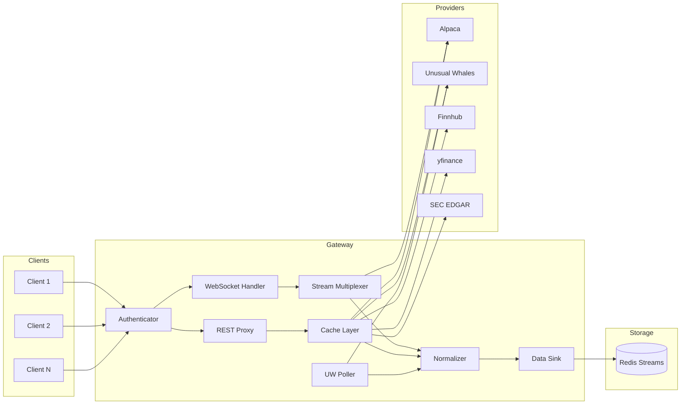

# Data Gateway

Unified financial data gateway for the Empire Trading Framework.

## Overview

Data Gateway provides a single WebSocket and REST interface for accessing multiple financial data providers with:

- **WebSocket multiplexing** — One upstream connection shared across multiple clients
- **REST proxy with caching** — Reduce API calls with intelligent caching
- **Client authentication** — API key based auth with permissions
- **Provider abstraction** — Plug-and-play data source integration
- **Idempotent trading** — Alpaca order writes auto-mint a `c-<client_id>-dg-<uuid>` `client_order_id` (ownership-prefixed) so a timeout (504) can be safely retried without double-placing
- **Bounded-queue sink dispatch** — Streaming events flow to Redis Streams through a per-sink bounded queue + worker pool, dropping only under genuine saturation

## Architecture



For a deep dive into each subsystem, see [docs/system-architecture.md](docs/system-architecture.md) and [docs/AUDIT_LOGGING.md](docs/AUDIT_LOGGING.md) for security auditing details.

| Provider | Data Types | API Key | Status |
|---|---|---|---|
| **Alpaca** | Equities, Options, Crypto, Forex | Required | ✅ Full |
| **Unusual Whales** | Flow, Darkpool, Greeks, Institutions | Required | ✅ Full |
| **Finnhub** | Fundamentals, Technicals, News, Forex | Required | ✅ Full |
| **Alpha Vantage** | Time Series, Indicators, Economic | Required | ✅ Full |
| **Massive** | Historical bars (survivorship-free) | Required | ⚠️ Loaded, not routed |
| **yfinance** | Fundamentals, History, Options | None | ✅ Full |
| **SEC EDGAR** | Filings, 13F, Insider Trades | None | ✅ Full |
| **News** | News articles (NewsAPI.org) | Required | ⚠️ Partial |

## Quick Start

### Prerequisites

- Python 3.12+
- Docker & Docker Compose (optional)

### Development Setup

```bash
# Clone and enter directory
cd Data-Gateway

# Copy environment file and configure API keys
cp .env.example .env

# Install dependencies (plain `uv sync` without --extra local uninstalls
# empire-core, empire-schemas, and the UW SDK — the gateway won't start)
uv sync --extra local --extra dev

# Run tests
uv run pytest tests/ -v

# Start locally
uv run uvicorn gateway.main:app --reload --port 8080
```

### Perf Guardrails

```bash
# Run perf gate locally
python scripts/perf_gate.py \
  --budgets-file config/perf_budgets.json \
  --baseline-file config/perf_baseline.json \
  --junit-xml perf-junit.xml \
  --log-file perf-output.txt \
  --summary-file perf-summary.json
```

Perf promotion/release runbook:
- `docs/audits/PERF_RELEASE_READINESS.md`

### Docker

```bash
docker-compose up --build
curl http://localhost:8080/health
```

## API Endpoints

| Prefix | Provider | Examples |
|---|---|---|
| `/api/v1/alpaca/*` | Alpaca | stocks, options, crypto, forex |
| `/api/v1/uw/*` | Unusual Whales | flow, darkpool, greeks, institutions |
| `/api/v1/finnhub/*` | Finnhub | fundamentals, technicals, forex |
| `/api/v1/alphavantage/*` | Alpha Vantage | time series, indicators |
| `/api/v1/yf/*` | yfinance | ticker info, history, options |
| `/api/v1/sec/*` | SEC EDGAR | filings, 13F, insiders |
| `/api/v1/calendar/*` | Trading Calendar | market hours, trading days |
| `/api/v1/symbology/*` | Symbol Resolution | OCC ↔ human format |
| `/api/v1/bulk/*` | Bulk Jobs | historical batch retrieval |
| `/api/v1/replay/*` | Historical Replay | backtesting sessions |
| `/api/v1/market/*` | Market Data | market-wide data |
| `/api/v1/news/*` | News | aggregated news |
| `/api/v1/backfill/*` | Backfill | historical backfill jobs |
| `/api/v1/corporate-actions/*` | Corporate Actions | splits, dividends |
| `/api/v1/adjustment-factors/*` | Adjustments | price adjustment factors |
| `/api/v1/admin/*` | Admin | status, logs, errors, cache |
| `/catalog/*` | Catalog | runtime API discovery |
| `/metrics` | Prometheus | metrics scrape |
| `/health/*` | Health | liveness, readiness, status |
| `/ws` | WebSocket | real-time streaming |

Authentication: Most endpoints require `X-Gateway-Key`. Health endpoints are public for probes.

Legacy aliases (deprecated): `/symbology/*`, `/corporate-actions/*`, `/adjustment-factors/*`.

Full OpenAPI docs available at `http://localhost:8080/docs` when running with `GATEWAY_DEBUG=true` (disabled in production).

## Data Pipeline

All data flows through a normalization and envelope pipeline before reaching clients or storage:

1. **Raw data** arrives from providers (REST, WebSocket, or poller)
2. **Normalizer** converts provider-specific formats to standard dataclasses (`NormalizedBar`, `NormalizedQuote`, `NormalizedTrade`)
3. **Envelope wrapper** adds metadata: event ID, timestamps, instrument key, source lineage
4. **Deduplicator** computes a BLAKE2b idempotency hash so reconnects/retries don't double-publish
5. **Data sink** publishes to Redis Streams for downstream storage (Heber) via a bounded per-sink queue drained by a worker pool — events are dropped only when the queue is full *and* workers can't drain it within the short producer-block timeout (surfaced as a metric)

## UW Poller

The Unusual Whales Poller runs independently, continuously polling UW endpoints and publishing results through the data sink.

**Real-time polls**: the poller loop ticks every 15s; flow alerts poll every 5 min, darkpool adaptively (15s/30s/60s by session), and market + sector tide hourly.

**EOD polls** (daily at 4:30 PM ET): 8 per-ticker endpoints (greek exposure, IV rank, IV term structure, OI change, historic option volume, short interest, short volume, FTDs) plus 2 market-wide endpoints (congress trades, insider trades).

The **Ticker Universe** manages which symbols are polled:

- ~30 static core tickers (mega-caps, major ETFs, sector ETFs)
- Configurable dynamic tickers refreshed daily from UW's stock screener

When `config/uw_pit_universe.json` (Atlas PIT universe export, path configurable via `GATEWAY_UW_UNIVERSE_FILE`) is present, its `active` symbol list replaces the core + dynamic universe and screener rotation is disabled; the core tickers + dynamic screener are the fallback when the file is missing.

See [docs/system-architecture.md](docs/system-architecture.md) for full details.

## Data Sink (Heber Integration)

When enabled, the gateway publishes all events to Redis Streams for downstream consumption by Heber (the storage layer). Events are wrapped in `EventEnvelope` format with idempotent (BLAKE2b) deduplication. Streaming dispatch uses a bounded per-sink queue and worker pool (see `GATEWAY_DATA_SINK_QUEUE_SIZE` / `GATEWAY_DATA_SINK_WORKER_COUNT` in [.env.example](.env.example)) so a slow Redis applies backpressure rather than silently dropping events.

## API Discovery

The Gateway provides runtime API discovery through catalog endpoints:

```bash
# Full API summary
curl -H "X-Gateway-Key: <your-gateway-api-key>" http://localhost:8080/catalog/

# WebSocket streams and channels
curl -H "X-Gateway-Key: <your-gateway-api-key>" http://localhost:8080/catalog/streams

# REST API providers and endpoints
curl -H "X-Gateway-Key: <your-gateway-api-key>" http://localhost:8080/catalog/providers

# Available feed types for subscriptions
curl -H "X-Gateway-Key: <your-gateway-api-key>" http://localhost:8080/catalog/feeds
```

See [docs/api-reference.md](docs/api-reference.md) for complete documentation.
Provider route contracts are generated from live routes in [PROVIDER_ENDPOINT_CONTRACT.md](PROVIDER_ENDPOINT_CONTRACT.md) via `python scripts/generate_provider_contract.py`.

## WebSocket Streaming

Connect to the Gateway WebSocket for real-time data:

```
ws://localhost:8080/ws
```

**Authentication:**

```json
{"action": "auth", "key": "gw_your_api_key"}
```

**Permissions:**
- Client permissions in `config/clients.yaml` are enforced for REST and WebSocket access.
- Provider access is restricted by `permissions.providers`.
- Feed access is restricted by `permissions.feeds`.
- Subscription and symbol limits are enforced (`max_symbols`, `ws_subscriptions_max`).
- Admin endpoints require a client `role` of `admin` or `super_admin`.
- Alpaca trading/account endpoints require a client `role` of `trader`, `admin`, or `super_admin`.

**Connection lifecycle:**
- On WebSocket disconnect, upstream Alpaca subscriptions are cleaned up automatically.

**Bulk and replay access control:**
- Bulk jobs and replay sessions are scoped to the client that created them.
- Replay WebSocket connections require `X-Gateway-Key` in the handshake and are restricted to the owning client.

**Subscribe to feeds:**

```json
{"action": "subscribe", "feeds": ["stock_bars"], "symbols": ["AAPL", "MSFT"]}
```

```json
{"action": "subscribe", "feeds": ["news"], "symbols": ["*"]}
```

### Available Feeds

| Feed | Description | Stream |
|------|-------------|--------|
| `stock_bars` | Stock minute bars | Alpaca SIP |
| `stock_quotes` | Stock NBBO quotes | Alpaca SIP |
| `stock_trades` | Stock trade executions | Alpaca SIP |
| `option_bars` | Options minute bars | Alpaca OPRA |
| `option_quotes` | Options quotes | Alpaca OPRA |
| `option_trades` | Options trade executions | Alpaca OPRA |
| `crypto_bars` | Crypto minute bars | Alpaca Crypto |
| `crypto_quotes` | Crypto quotes | Alpaca Crypto |
| `crypto_trades` | Crypto trade executions | Alpaca Crypto |
| `crypto_orderbooks` | Crypto Level 2 orderbooks | Alpaca Crypto |
| `news` | Real-time news articles | Alpaca News |

Additional stock/crypto feeds (`dailyBars`, `updatedBars`, `lulds`, `statuses`, `imbalances`) are also supported — see `/catalog/feeds` for the authoritative list.

**Symbol Formats:**

- Stocks: `AAPL`, `MSFT`
- Options (OCC): `AAPL240119C00190000`
- Crypto: `BTC/USD`, `ETH/USD`
- News: `*` (all) or specific tickers

## Configuration

### Environment Variables

#### Core Settings

| Variable | Description | Default |
|---|---|---|
| `GATEWAY_DEBUG` | Enable debug mode | `false` |
| `EMPIRE_LOG_LEVEL` | Log level (read by `empire_core.logger`) | `INFO` |
| `GATEWAY_HOST` | Server host | `0.0.0.0` |
| `GATEWAY_PORT` | Server port | `8080` |
| `GATEWAY_AUTH_TIMEOUT_SECONDS` | WebSocket auth timeout | `10` |
| `GATEWAY_ALLOW_STUB_DATA` | Allow stub/mock data responses | `false` |

#### Cache Settings

| Variable | Description | Default |
|---|---|---|
| `GATEWAY_CACHE_MAX_SIZE` | Max cache entries | `10000` |
| `GATEWAY_CACHE_DEFAULT_TTL` | Default TTL (seconds) | `300` |

> **Note:** Cache entries are scoped per client (by `X-Gateway-Key`) to avoid cross-client data leakage.

#### Provider API Keys

| Variable | Provider | Required |
|---|---|---|
| `APCA_API_KEY_ID` | Alpaca | Yes |
| `APCA_API_SECRET_KEY` | Alpaca | Yes |
| `UNUSUAL_WHALES_API_KEY` | Unusual Whales | Yes |
| `FINNHUB_API_KEY` | Finnhub | Yes |
| `ALPHAVANTAGE_API_KEY` | Alpha Vantage | Yes |
| `NEWS_API_KEY` | NewsAPI.org | Optional |
| `SEC_USER_AGENT` | SEC EDGAR | Optional (recommended) |

> **Note:** SEC EDGAR and yfinance require no API keys.

#### UW EOD Polling

| Variable | Description | Default |
|---|---|---|
| `GATEWAY_UW_EOD_ENABLED` | Enable daily EOD polling | `false` |
| `GATEWAY_UW_EOD_HOUR` | EOD poll hour (ET) | `16` |
| `GATEWAY_UW_EOD_MINUTE` | EOD poll minute (ET) | `30` |
| `GATEWAY_UW_CORE_TICKERS` | Comma-separated core ticker override | (defaults ~30) |
| `GATEWAY_UW_DYNAMIC_TICKER_COUNT` | Dynamic tickers from screener | `20` |
| `GATEWAY_UW_EOD_CONCURRENCY` | Concurrent ticker polls | `5` |

#### Data Sink

| Variable | Description | Default |
|---|---|---|
| `GATEWAY_DATA_SINK_ENABLED` | Enable Redis Streams sink | `false` |
| `GATEWAY_DATA_SINK_REDIS_URL` | Redis URL for sink | — |

### Client Keys

Keys are managed with the CLI (`uv run python -m gateway.cli generate-key` / `add-client`), which writes hashed entries to `config/clients.yaml`:

```yaml
clients:
  - id: my_client
    key_hash: sha256:<sha256-of-key>
    role: trader
    permissions:
      providers: [alpaca, unusual_whales]
      feeds: [bars, quotes, flow]
      max_symbols: 1000
      rate_limit: 600
    enabled: true
```

A plaintext `key:` field is still accepted as a dev-only fallback and triggers a `clients_plaintext_keys_in_use` warning at startup.

## Development

### Code Quality

```bash
uv sync --extra local --extra dev
pre-commit install
pre-commit run --all-files
python scripts/generate_provider_contract.py --check
```

**Tools:** ruff (lint + format), pyright, bandit, detect-secrets, pre-commit

### Testing

```bash
pytest tests/ -v
pytest --cov=gateway --cov-report=term-missing
```

### CI Pipeline

GitHub Actions runs on PRs and pushes to `master`:

1. Pre-commit hooks, bandit security scan, mypy type check, provider-contract check, pytest with coverage
2. Integration tests against real Redis
3. SonarCloud analysis

## License

MIT
