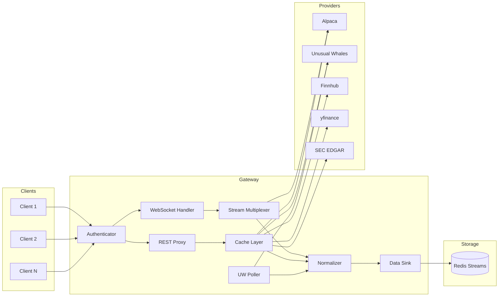

# Data Gateway

Unified financial data gateway for the Empire Trading Framework.

## Overview

Data Gateway provides a single WebSocket and REST interface for accessing multiple financial data providers with:

- **WebSocket multiplexing** — One upstream connection shared across multiple clients
- **REST proxy with caching** — Reduce API calls with intelligent caching
- **Client authentication** — API key based auth with permissions
- **Provider abstraction** — Plug-and-play data source integration

## Architecture



For a deep dive into each subsystem, see [docs/ARCHITECTURE.md](docs/ARCHITECTURE.md).

| Provider | Data Types | API Key | Status |
|---|---|---|---|
| **Alpaca** | Equities, Options, Crypto, Forex | Required | ✅ Full |
| **Unusual Whales** | Flow, Darkpool, Greeks, Institutions | Required | ✅ Full |
| **Finnhub** | Fundamentals, Technicals, News, Forex | Required | ✅ Full |
| **Alpha Vantage** | Time Series, Indicators, Economic | Required | ✅ Full |
| **yfinance** | Fundamentals, History, Options | None | ✅ Full |
| **SEC EDGAR** | Filings, 13F, Insider Trades | None | ✅ Full |
| **News** | News articles (NewsAPI.org) | Required | ⚠️ Partial |

## Quick Start

### Prerequisites

- Python 3.12+
- Docker & Docker Compose (optional)

### Development Setup

```bash
# Clone and enter directory
cd Data-Gateway

# Copy environment file and configure API keys
cp .env.example .env

# Install dependencies
pip install -e ".[dev]"

# Run tests
pytest tests/ -v

# Start locally
uvicorn gateway.main:app --reload --port 8080
```

### Perf Guardrails

```bash
# Run perf gate locally
python scripts/perf_gate.py \
  --budgets-file config/perf_budgets.json \
  --baseline-file config/perf_baseline.json \
  --junit-xml perf-junit.xml \
  --log-file perf-output.txt \
  --summary-file perf-summary.json
```

Perf promotion/release runbook:

- `PERF_RELEASE_READINESS.md`
- `runbook.md` — Operations reference (startup, config, troubleshooting, monitoring)

### Docker

```bash
docker-compose up --build
curl http://localhost:8080/health
```

## API Endpoints

| Prefix | Provider | Examples |
|---|---|---|
| `/api/v1/alpaca/*` | Alpaca | stocks, options, crypto, forex |
| `/api/v1/uw/*` | Unusual Whales | flow, darkpool, greeks, institutions |
| `/api/v1/finnhub/*` | Finnhub | fundamentals, technicals, forex |
| `/api/v1/alphavantage/*` | Alpha Vantage | time series, indicators |
| `/api/v1/yf/*` | yfinance | ticker info, history, options |
| `/api/v1/sec/*` | SEC EDGAR | filings, 13F, insiders |
| `/api/v1/calendar/*` | Trading Calendar | market hours, trading days |
| `/api/v1/symbology/*` | Symbol Resolution | OCC ↔ human format |
| `/api/v1/bulk/*` | Bulk Jobs | historical batch retrieval |
| `/api/v1/replay/*` | Historical Replay | backtesting sessions |
| `/health/*` | Health | liveness, readiness, status |
| `/ws` | WebSocket | real-time streaming |

Authentication: Most endpoints require `X-Gateway-Key`. Health endpoints are public for probes.

Legacy aliases (deprecated): `/symbology/*`, `/corporate-actions/*`, `/adjustment-factors/*`.

Full OpenAPI docs available at `http://localhost:8080/docs` when running.

## Data Pipeline

All data flows through a normalization and envelope pipeline before reaching clients or storage:

1. **Raw data** arrives from providers (REST, WebSocket, or poller)
2. **Normalizer** converts provider-specific formats to standard dataclasses (`NormalizedBar`, `NormalizedQuote`, `NormalizedTrade`)
3. **Envelope wrapper** adds metadata: event ID, timestamps, instrument key, source lineage
4. **Deduplicator** computes a SHA-256 hash for idempotent delivery
5. **Data sink** publishes to Redis Streams for downstream storage (Heber)

## UW Poller

The Unusual Whales Poller runs independently, continuously polling UW endpoints and publishing results through the data sink.

**Real-time polls** (every 60s): flow alerts, darkpool, market tide, sector tide.

**EOD polls** (daily at 4:30 PM ET): 9 per-ticker endpoints including greek exposure, IV rank, OI change, short interest, FTDs, congress trades, and insider trades.

The **Ticker Universe** manages which symbols are polled:

- ~30 static core tickers (mega-caps, major ETFs, sector ETFs)
- Configurable dynamic tickers refreshed daily from UW's stock screener

See [docs/ARCHITECTURE.md](docs/ARCHITECTURE.md) for full details.

## Data Sink (Heber Integration)

When enabled, the gateway publishes all events to Redis Streams for downstream consumption by Heber (the storage layer). Events are wrapped in `EventEnvelope` format with idempotent deduplication.

## API Discovery

The Gateway provides runtime API discovery through catalog endpoints:

```bash
# Full API summary
curl -H "X-Gateway-Key: <your-gateway-api-key>" http://localhost:8080/catalog/

# WebSocket streams and channels
curl -H "X-Gateway-Key: <your-gateway-api-key>" http://localhost:8080/catalog/streams

# REST API providers and endpoints
curl -H "X-Gateway-Key: <your-gateway-api-key>" http://localhost:8080/catalog/providers

# Available feed types for subscriptions
curl -H "X-Gateway-Key: <your-gateway-api-key>" http://localhost:8080/catalog/feeds
```

See [API_REFERENCE.md](API_REFERENCE.md) for complete documentation.
Provider route contracts are generated from live routes in [PROVIDER_ENDPOINT_CONTRACT.md](PROVIDER_ENDPOINT_CONTRACT.md) via `python scripts/generate_provider_contract.py`.

## WebSocket Streaming

Connect to the Gateway WebSocket for real-time data:

```
ws://localhost:8080/ws
```

**Authentication:**

```json
{"action": "auth", "key": "gw_your_api_key"}
```

**Permissions:**

- Client permissions in `config/clients.yaml` are enforced for REST and WebSocket access.
- Provider access is restricted by `permissions.providers`.
- Feed access is restricted by `permissions.feeds`.
- Subscription and symbol limits are enforced (`max_symbols`, `ws_subscriptions_max`).
- Admin endpoints require a client `role` of `admin` or `super_admin`.
- Alpaca trading/account endpoints require a client `role` of `trader`, `admin`, or `super_admin`.

**Connection lifecycle:**

- On WebSocket disconnect, upstream Alpaca subscriptions are cleaned up automatically.

**Bulk and replay access control:**

- Bulk jobs and replay sessions are scoped to the client that created them.
- Replay WebSocket connections require `X-Gateway-Key` in the handshake and are restricted to the owning client.

**Subscribe to feeds:**

```json
{"action": "subscribe", "feeds": ["stock_bars"], "symbols": ["AAPL", "MSFT"]}
```

```json
{"action": "subscribe", "feeds": ["news"], "symbols": ["*"]}
```

### Available Feeds

| Feed | Description | Stream |
|------|-------------|--------|
| `stock_bars` | Stock minute bars | Alpaca SIP |
| `stock_quotes` | Stock NBBO quotes | Alpaca SIP |
| `stock_trades` | Stock trade executions | Alpaca SIP |
| `option_bars` | Options minute bars | Alpaca OPRA |
| `option_quotes` | Options quotes | Alpaca OPRA |
| `crypto_bars` | Crypto minute bars | Alpaca Crypto |
| `crypto_orderbooks` | Crypto Level 2 orderbooks | Alpaca Crypto |
| `news` | Real-time news articles | Alpaca News |

**Symbol Formats:**

- Stocks: `AAPL`, `MSFT`
- Options (OCC): `AAPL240119C00190000`
- Crypto: `BTC/USD`, `ETH/USD`
- News: `*` (all) or specific tickers

## Configuration

### Environment Variables

#### Core Settings

| Variable | Description | Default |
|---|---|---|
| `GATEWAY_DEBUG` | Enable debug mode | `false` |
| `GATEWAY_LOG_LEVEL` | Log level | `INFO` |
| `GATEWAY_HOST` | Server host | `0.0.0.0` |
| `GATEWAY_PORT` | Server port | `8080` |
| `GATEWAY_AUTH_TIMEOUT_SECONDS` | WebSocket auth timeout | `10` |
| `GATEWAY_ALLOW_STUB_DATA` | Allow stub/mock data responses | `false` |

#### Cache Settings

| Variable | Description | Default |
|---|---|---|
| `GATEWAY_CACHE_MAX_SIZE` | Max cache entries | `10000` |
| `GATEWAY_CACHE_DEFAULT_TTL` | Default TTL (seconds) | `300` |

> **Note:** Cache entries are scoped per client (by `X-Gateway-Key`) to avoid cross-client data leakage.

#### Provider API Keys

| Variable | Provider | Required |
|---|---|---|
| `APCA_API_KEY_ID` | Alpaca | Yes |
| `APCA_API_SECRET_KEY` | Alpaca | Yes |
| `UNUSUAL_WHALES_API_KEY` | Unusual Whales | Yes |
| `FINNHUB_API_KEY` | Finnhub | Yes |
| `ALPHAVANTAGE_API_KEY` | Alpha Vantage | Yes |
| `NEWS_API_KEY` | NewsAPI.org | Optional |
| `SEC_USER_AGENT` | SEC EDGAR | Optional (recommended) |

> **Note:** SEC EDGAR and yfinance require no API keys.

#### UW EOD Polling

| Variable | Description | Default |
|---|---|---|
| `GATEWAY_UW_EOD_ENABLED` | Enable daily EOD polling | `false` |
| `GATEWAY_UW_EOD_HOUR` | EOD poll hour (ET) | `16` |
| `GATEWAY_UW_EOD_MINUTE` | EOD poll minute (ET) | `30` |
| `GATEWAY_UW_CORE_TICKERS` | Comma-separated core ticker override | (defaults ~30) |
| `GATEWAY_UW_DYNAMIC_TICKER_COUNT` | Dynamic tickers from screener | `20` |
| `GATEWAY_UW_EOD_CONCURRENCY` | Concurrent ticker polls | `5` |

#### Data Sink

| Variable | Description | Default |
|---|---|---|
| `GATEWAY_DATA_SINK_ENABLED` | Enable Redis Streams sink | `false` |
| `GATEWAY_DATA_SINK_REDIS_URL` | Redis URL for sink | — |

### Client Keys

Edit `config/clients.yaml` to manage API keys:

```yaml
clients:
  - id: my_client
    key: gw_my_api_key
    permissions:
      providers: [alpaca, unusual_whales]
      feeds: [bars, quotes, flow]
      max_symbols: 1000
    enabled: true
```

## Development

### Code Quality

```bash
pip install -e ".[dev]"
pre-commit install
pre-commit run --all-files
python scripts/generate_provider_contract.py --check
```

**Tools:** ruff, black, pyright, bandit, detect-secrets

### Testing

```bash
pytest tests/ -v
pytest --cov=gateway --cov-report=term-missing
```

### CI Pipeline

GitHub Actions runs on PRs and pushes to `main`:

1. Pre-commit hooks + pytest with coverage
2. SonarCloud analysis

## License

MIT
