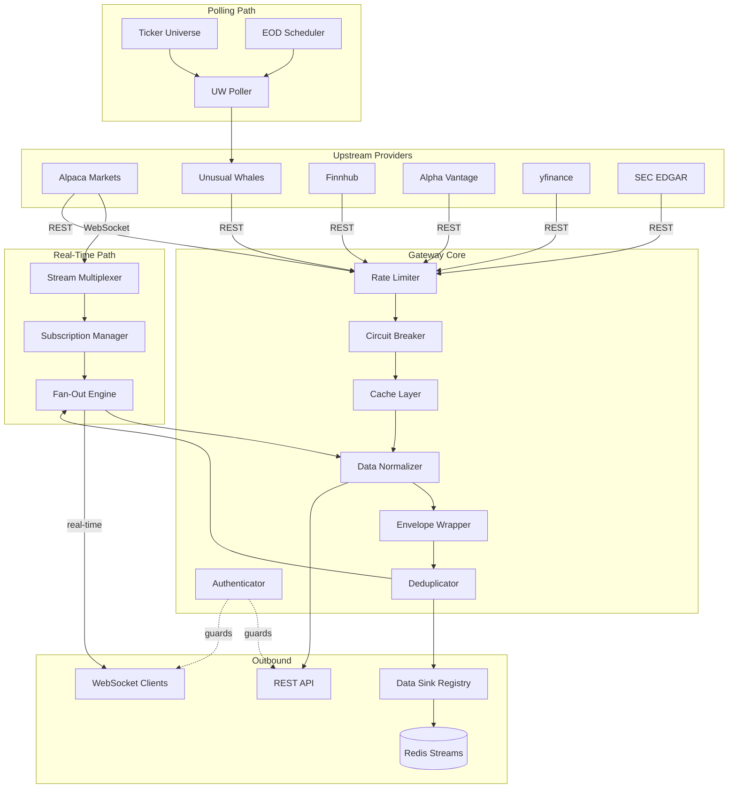
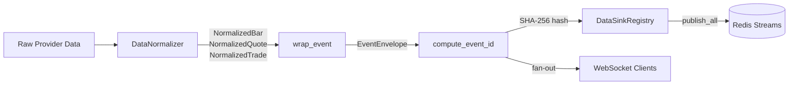
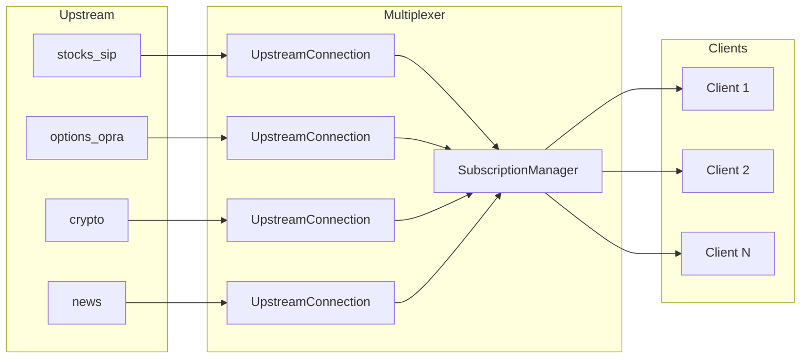
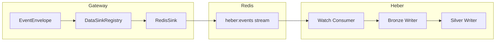

# Data Gateway — Architecture

System architecture and data flow documentation for the Data Gateway.

---

## System Overview

The Data Gateway is a unified financial data gateway that proxies, normalizes, and distributes data from multiple upstream providers to downstream clients and storage systems.

---

## Core Subsystems

### Provider Registry

Providers implement the `DataProvider` abstract base class and are registered via `config/providers.yaml`. Each provider handles authentication, request formatting, and response parsing for its upstream API.

| Module | Purpose |
|--------|---------|
| `core/provider.py` | `DataProvider` ABC |
| `core/registry.py` | Provider discovery and lifecycle |
| `providers/alpaca.py` | Alpaca Markets (equities, options, crypto) |
| `providers/uw.py` | Unusual Whales (flow, darkpool, greeks) |
| `providers/finnhub.py` | Finnhub (fundamentals, earnings, news) |
| `providers/alphavantage.py` | Alpha Vantage (indicators, forex) |
| `providers/yfinance.py` | yfinance (fundamentals, history) |
| `providers/sec.py` | SEC EDGAR (filings, 13F, insiders) |

### Authentication & Security

API key authentication with role-based access control. All requests (REST and WebSocket) require an `X-Gateway-Key` header.

| Module | Purpose |
|--------|---------|
| `core/auth.py` | Key validation, client lookup, permissions |
| `core/security.py` | DDoS protection, IP blocking, security headers |
| `core/validator.py` | Input validation, symbol format checking |

### Caching

Two-tier cache with in-memory L1 and optional Redis L2. Cache keys are scoped per-client to prevent data leakage.

| Module | Purpose |
|--------|---------|
| `core/cache.py` | `HybridCache` with L1/L2 tiering |
| `core/redis_cache.py` | Redis cache backend |

### Rate Limiting & Circuit Breaker

Per-provider rate limiting based on upstream API quotas. Circuit breaker prevents cascading failures when a provider is down.

| Module | Purpose |
|--------|---------|
| `core/rate_limiter.py` | Token bucket rate limiter (per-provider) |
| `core/circuit_breaker.py` | Three-state circuit breaker (closed → open → half-open) |

---

## Data Pipeline

All data — whether from REST responses, WebSocket streams, or poller results — flows through the same normalization and envelope pipeline before reaching clients or storage.

### Normalization (`core/normalizer.py`)

Converts provider-specific field names to standard dataclasses:

| Dataclass | Fields |
|-----------|--------|
| `NormalizedBar` | symbol, timestamp, OHLCV, vwap, trade_count, provider, timeframe |
| `NormalizedQuote` | symbol, timestamp, bid/ask price+size, exchanges, provider |
| `NormalizedTrade` | symbol, timestamp, price, size, trade_id, exchange, conditions |

Supports Alpaca (short field names: `S`, `t`, `o`, `h`, `l`, `c`, `v`), yfinance, and generic formats.

### Envelope (`core/envelope.py`)

Wraps normalized events in an `EventEnvelope` for consistent downstream routing:

| Field | Description |
|-------|-------------|
| `event_id` | SHA-256 idempotency hash (provider + feed + instrument + timestamp + unique fields) |
| `schema_version` | Envelope format version (`v1`) |
| `provider` | Source provider name |
| `feed` | Feed type (bars, quotes, flow_alerts, etc.) |
| `instrument_key` | Canonical key (`equity:AAPL`, `crypto:BTC-USD`, etc.) |
| `ts_event` | When the event occurred |
| `ts_ingest` | When the gateway received it |
| `payload` | The normalized event data |

### Deduplication (`core/dedup.py`)

Redis-backed deduplication using `event_id`. Prevents duplicate events from being published when the same data arrives via multiple paths (REST + WebSocket, poller retries).

---

## WebSocket Architecture

### Stream Multiplexer (`core/stream.py`)

Maintains one upstream WebSocket connection per Alpaca stream type and fans out to all subscribed downstream clients.

**Key features:**

- **Lazy connections** — upstream connections are only established when a client subscribes
- **Subscription aggregation** — computes the union of all client subscriptions for upstream
- **Reference counting** — upstream subscriptions are removed only when the last client unsubscribes
- **Auto-reconnect** — exponential backoff with jitter on connection failures
- **MessagePack support** — OPRA options stream uses binary MessagePack encoding

### Connection Lifecycle

1. Client connects to `ws://host:8080/ws`
2. Client sends `{"action": "auth", "key": "gw_..."}` (10s timeout)
3. Client sends `{"action": "subscribe", "feeds": [...], "symbols": [...]}`
4. Gateway aggregates subscriptions, opens/reuses upstream connections
5. Data flows: upstream → normalizer → envelope → fan-out → client
6. On client disconnect: subscriptions removed, upstream unsubscribed if no other clients need it

---

## UW Poller

The Unusual Whales Poller (`core/uw_poller.py`) runs independently of client requests, continuously polling UW endpoints and publishing results through the data sink.

### Real-Time Polls (every 60s)

| Feed | Endpoint | Description |
|------|----------|-------------|
| `flow_alerts` | `/api/stock/flow` | Options flow alerts |
| `darkpool` | `/api/darkpool/recent` | Dark pool transactions |
| `market_tide` | `/api/market/market-tide` | Market-wide sentiment |
| `sector_tide` | `/api/market/sector-etf-tide` | Sector rotation |

### EOD Polls (daily at 4:30 PM ET)

Polls 9 per-ticker endpoints for each ticker in the universe:

| Feed | Endpoint | Priority |
|------|----------|----------|
| `greek_exposure` | `/api/stock/{ticker}/greek-exposure` | High |
| `iv_rank` | `/api/stock/{ticker}/iv-rank` | High |
| `oi_change` | `/api/stock/{ticker}/oi-change` | High |
| `historic_option_volume` | `/api/stock/{ticker}/historical/option-volume` | High |
| `short_interest` | `/api/stock/{ticker}/short-interest` | Medium |
| `short_volume` | `/api/stock/{ticker}/short-volume` | Medium |
| `ftds` | `/api/stock/{ticker}/ftds` | Medium |
| `congress_trades` | `/api/stock/{ticker}/congress-trades` | Medium |
| `insider_trades` | `/api/stock/{ticker}/insider-trades` | Medium |

### Ticker Universe (`core/ticker_universe.py`)

Manages which symbols are polled daily:

- **Core tickers** (~30): Mega-cap stocks, major ETFs, sector ETFs (SPY, QQQ, AAPL, NVDA, XLF, etc.)
- **Dynamic tickers** (configurable, default 20): Refreshed daily from UW stock screener, sorted by options activity
- Deduplication ensures no overlap between core and dynamic sets

---

## Data Sink (Heber Integration)

The data sink publishes all gateway events to Redis Streams for downstream consumption by the Heber storage system.

| Module | Purpose |
|--------|---------|
| `core/data_sink.py` | `DataSink` ABC + `DataSinkRegistry` (fan-out to all sinks) |
| `core/redis_sink.py` | Redis Streams implementation with backpressure |

**Features:**

- Fire-and-forget publishing (non-blocking)
- Per-sink in-flight limits for backpressure
- Redis-backed deduplication (same `event_id` is never published twice)
- Circuit breaker integration (stops publishing when Redis is down)

---

## Schemas (`gateway/schemas/__init__.py`)

All Pydantic data models used for normalization, WebSocket messaging, and API responses.

### WebSocket Messages

| Schema | Purpose |
|--------|---------|
| `AuthMessage` | Client authentication (`action: auth`) |
| `SubscribeMessage` | Subscribe to feeds/symbols |
| `UnsubscribeMessage` | Unsubscribe from feeds/symbols |
| `AuthResult` | Auth success/failure response |
| `SubscriptionAck` | Subscription confirmation |

### Normalized Market Data

| Schema | Fields |
|--------|--------|
| `NormalizedBar` | symbol, timestamp, OHLCV, vwap, trade_count, provider, timeframe |
| `NormalizedQuote` | symbol, timestamp, bid/ask price+size, exchanges, conditions, provider |
| `NormalizedTrade` | symbol, timestamp, price, size, trade_id, exchange, conditions, provider |
| `NormalizedOptionContract` | contract_symbol, underlying, strike, expiry, greeks (δγθν), bid/ask, IV |

### UW Flow & Alternative Data

| Schema | Source |
|--------|--------|
| `NormalizedFlowAlert` | UW options flow (premium, side, sentiment, sweep/block flags) |
| `NormalizedDarkpoolTrade` | UW darkpool (notional, NBBO context, ext_hours flag) |
| `NormalizedMarketTide` | UW market sentiment (net call/put premium, sentiment label) |
| `NormalizedSectorTide` | UW per-sector GICS sentiment |
| `NormalizedInsiderTrade` | SEC Form 4 insider filings (shares, value, 10b5-1 flag) |
| `NormalizedInstitutionHolding` | 13F institutional holdings (shares, % portfolio, change type) |
| `NormalizedPoliticianTrade` | Congressional trading disclosures |

### Analytics & Screener

| Schema | Purpose |
|--------|---------|
| `NormalizedGreekExposure` | GEX/DEX/VEX exposure data |
| `NormalizedIVRank` | IV rank/percentile with 1Y high/low |
| `NormalizedOIChange` | Open interest changes (call/put OI delta) |
| `NormalizedMaxPain` | Max pain strike per expiry |
| `NormalizedNetPremiumTick` | Net premium flow ticks |
| `NormalizedScreenerResult` | Stock screener results |
| `NormalizedMostActive` | Most active stocks by volume |
| `NormalizedMover` | Top gainers/losers |
| `NormalizedHottestChain` | Hottest option contracts |

### Other

| Schema | Purpose |
|--------|---------|
| `NormalizedNewsArticle` | News articles (headline, source, symbols) |
| `NormalizedEarnings` | Earnings calendar (EPS/revenue est. vs actual) |
| `NormalizedETFHolding` | ETF constituent weights |
| `NormalizedETFFlow` | ETF inflow/outflow data |
| `NormalizedShortData` | Short interest & days to cover |
| `NormalizedFTD` | Failures to deliver |
| `NormalizedCorporateAction` | Splits, dividends, spinoffs |
| `NormalizedForexRate` | Forex exchange rates |
| `NormalizedFundamentals` | Company fundamental metrics |
| `EventEnvelope` | Wrapper for all events (event_id, feed, instrument_key, payload) |
| `SuccessResponse` | Standard API success wrapper |

---

## Module Map

### `gateway/core/` — Business Logic

| Module | Lines | Purpose |
|--------|-------|---------|
| `stream.py` | 982 | WebSocket multiplexer, upstream connections, subscription management |
| `uw_poller.py` | 1021 | UW real-time + EOD polling, ticker universe integration |
| `security.py` | 683 | DDoS protection, IP blocking, request validation |
| `bulk.py` | 999 | Bulk data job orchestration |
| `replay.py` | 587 | Historical data replay sessions |
| `quality.py` | 490 | Data quality gates and monitoring |
| `metrics.py` | 459 | Prometheus metrics collection |
| `normalizer.py` | 349 | Data normalization (provider → standard format) |
| `envelope.py` | 410 | Event envelope wrapping + idempotency hashing |
| `symbology.py` | 421 | OCC ↔ human option symbol conversion |
| `validator.py` | 400 | Input validation and sanitization |
| `calendar.py` | 452 | Trading calendar, market hours, earnings |
| `data_sink.py` | 289 | Data sink abstraction + registry |
| `cache.py` | 350 | Hybrid L1/L2 cache |
| `circuit_breaker.py` | 352 | Circuit breaker state machine |
| `rate_limiter.py` | 293 | Token bucket rate limiter |
| `auth.py` | 132 | Client authentication |
| `dedup.py` | 200 | Redis-backed event deduplication |
| `ticker_universe.py` | 136 | Core + dynamic ticker management |

### `gateway/api/` — REST Routes

| Module | Purpose |
|--------|---------|
| `websocket.py` | WebSocket endpoint handler |
| `middleware.py` | Request/response middleware, normalization |
| `catalog.py` | API discovery endpoints |
| `alpaca/` | Alpaca market data + trading routes |
| `uw/` | Unusual Whales routes |
| `finnhub/` | Finnhub routes |
| `alphavantage/` | Alpha Vantage routes |
| `yf.py` | yfinance routes |
| `sec.py` | SEC EDGAR routes |
| `news.py` | News aggregator routes |
| `health.py` | Health/readiness/status endpoints |
| `admin.py` | Admin management endpoints |
| `bulk.py` | Bulk data job endpoints |
| `replay.py` | Historical replay endpoints |
| `calendar.py` | Trading calendar endpoints |
| `symbology.py` | Symbol resolution endpoints |
| `corporate.py` | Corporate actions endpoints |
| `quality.py` | Data quality endpoints |
| `deps.py` | FastAPI dependency injection |
