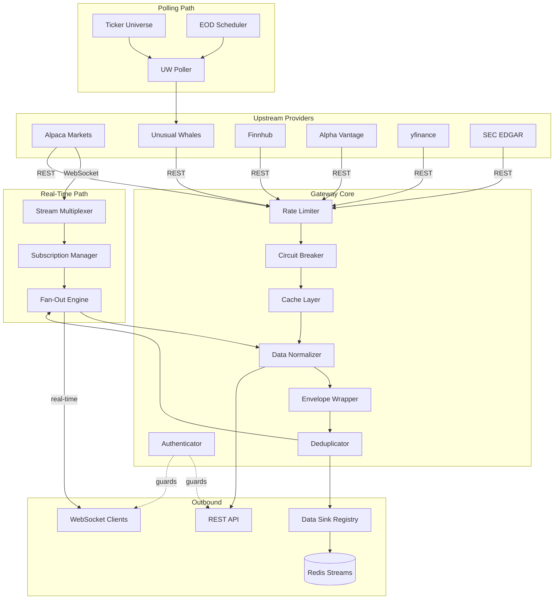
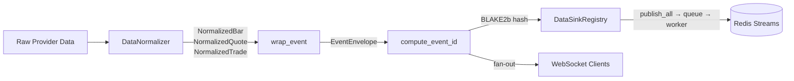
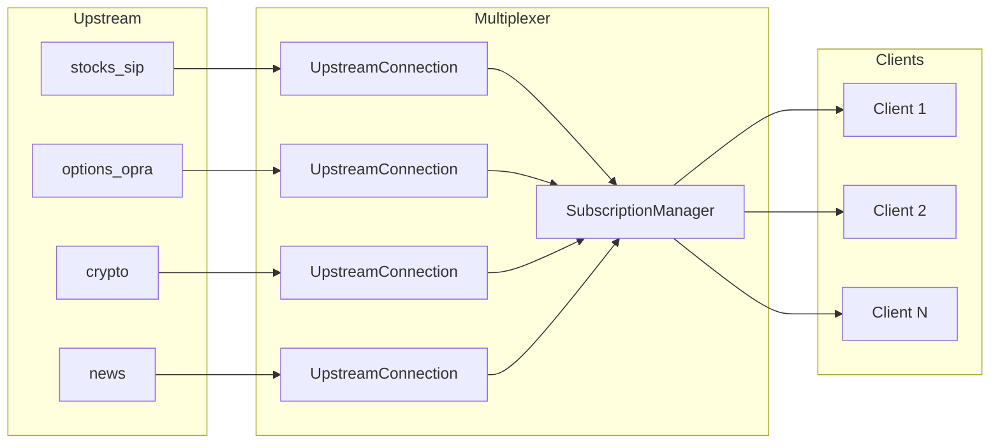
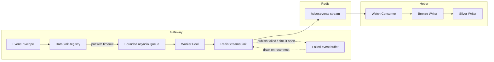

# Data Gateway — Architecture

System architecture and data flow documentation for the Data Gateway.

---

## System Overview

The Data Gateway is a unified financial data gateway that proxies, normalizes, and distributes data from multiple upstream providers to downstream clients and storage systems.



---

## Core Subsystems

### Provider Registry

Providers implement the `DataProvider` abstract base class and are registered via `config/providers.yaml`. Each provider handles authentication, request formatting, and response parsing for its upstream API.

| Module | Purpose |
|--------|---------|
| `core/provider.py` | `DataProvider` ABC |
| `core/registry.py` | Provider discovery and lifecycle |
| `providers/alpaca.py` | Alpaca Markets (equities, options, crypto) |
| `providers/uw.py` | Unusual Whales (flow, darkpool, greeks) |
| `providers/finnhub.py` | Finnhub (fundamentals, earnings, news) |
| `providers/alphavantage.py` | Alpha Vantage (indicators, forex) |
| `providers/yfinance.py` | yfinance (fundamentals, history) |
| `providers/sec.py` | SEC EDGAR (filings, 13F, insiders) |

### Authentication & Security

API key authentication with role-based access control. All requests (REST and WebSocket) require an `X-Gateway-Key` header.

| Module | Purpose |
|--------|---------|
| `core/auth.py` | Key validation, client lookup, permissions |
| `core/security.py` | DDoS protection, IP blocking, security headers |
| `core/validator.py` | Input validation, symbol format checking |
| `core/audit.py` | Structured audit logging for security events |

For details on the audit system, see [docs/AUDIT_LOGGING.md](AUDIT_LOGGING.md).

### Caching

Two-tier cache with in-memory L1 and optional Redis L2. Cache keys are scoped per-client to prevent data leakage.

| Module | Purpose |
|--------|---------|
| `core/cache.py` | `HybridCache` with L1/L2 tiering |
| `core/redis_cache.py` | Redis cache backend |

### Rate Limiting & Circuit Breaker

Per-provider rate limiting based on upstream API quotas. Circuit breaker prevents cascading failures when a provider is down.

| Module | Purpose |
|--------|---------|
| `core/rate_limiter.py` | Token bucket rate limiter (per-provider) |
| `core/circuit_breaker.py` | Three-state circuit breaker (closed → open → half-open) |

**Per-circuit severity convention.** When a circuit trips open, the log severity depends on the circuit name. Data-sink circuits (`data_sink:*`, e.g. `data_sink:redis_streams`) log `circuit_opened` at **WARNING** with code `GW-W1013` — opening is controlled degradation because the sink layer has its own retry/buffer logic. Upstream provider circuits (REST/WS) log at **ERROR** with code `GW-E1011`. The Redis-streams sink circuit also uses a higher trip threshold (`failure_threshold=20`, `recovery_timeout=15s`) than the default (5 / 60s), because each counted failure already survived the sink's own 3-attempt retry — reaching 20 means Redis is genuinely down.

### Error-Log Severity Convention

Provider and API-layer HTTP errors are logged by status class, so a single misconfigured client cannot bury genuine upstream failures in the WARNING+ errors log:

- **4xx (client-caused)** → `logger.warning`. Example: requesting an index symbol like `SPX` from `/v2/stocks/bars` returns a 400; that is the caller's mistake, not an upstream fault, and `http_retry` does not retry it.
- **5xx (upstream failure)** → `logger.error`.

The split lives in `gateway/api/alpaca/common.py` (`execute_alpaca_provider_call`) and is mirrored at the provider layer in `gateway/providers/alpaca/market.py` (`get_bars`, `get_quotes`).

---

## Data Pipeline

All data — whether from REST responses, WebSocket streams, or poller results — flows through the same normalization and envelope pipeline before reaching clients or storage.



> For WebSocket streaming events the envelope is produced by the
> `fast_wrap_streaming_event` hot path: it skips Pydantic validation and
> instrument inference but still derives `event_id` from a content-based
> BLAKE2b hash (feed-specific unique fields + provider/feed/instrument/`ts_event`/sequence)
> so the same upstream Alpaca event delivered twice — e.g. on a reconnect
> replay — resolves to the same `event_id` and Heber's dedup layers reject
> the duplicate.

### Normalization (`core/normalizer.py`)

Converts provider-specific field names to standard dataclasses:

| Dataclass | Fields |
|-----------|--------|
| `NormalizedBar` | symbol, timestamp, OHLCV, vwap, trade_count, provider, timeframe |
| `NormalizedQuote` | symbol, timestamp, bid/ask price+size, exchanges, provider |
| `NormalizedTrade` | symbol, timestamp, price, size, trade_id, exchange, conditions |

Supports Alpaca (short field names: `S`, `t`, `o`, `h`, `l`, `c`, `v`), yfinance, and generic formats.

### Envelope (`core/envelope.py`)

Wraps normalized events in an `EventEnvelope` for consistent downstream routing:

| Field | Description |
|-------|-------------|
| `event_id` | BLAKE2b idempotency hash (provider + feed + instrument + timestamp + feed-specific unique fields) |
| `schema_version` | Envelope format version (`v1`) |
| `provider` | Source provider name |
| `feed` | Feed type (bars, quotes, flow_alerts, etc.) |
| `instrument_key` | Canonical key (`equity:AAPL`, `crypto:BTC-USD`, etc.) |
| `ts_event` | When the event occurred |
| `ts_ingest` | When the gateway received it |
| `payload` | The normalized event data |

### Deduplication (`core/dedup.py`)

Redis-backed deduplication using `event_id`. Prevents duplicate events from being published when the same data arrives via multiple paths (REST + WebSocket, poller retries).

---

## WebSocket Architecture

### Stream Multiplexer (`core/stream.py`)

Maintains one upstream WebSocket connection per Alpaca stream type and fans out to all subscribed downstream clients.



**Key features:**

- **Lazy connections** — upstream connections are only established when a client subscribes
- **Subscription aggregation** — computes the union of all client subscriptions for upstream
- **Reference counting** — upstream subscriptions are removed only when the last client unsubscribes
- **Auto-reconnect** — exponential backoff with jitter on connection failures
- **MessagePack support** — OPRA options stream uses binary MessagePack encoding

### Connection Lifecycle

1. Client connects to `ws://host:8080/ws`
2. Client sends `{"action": "auth", "key": "gw_..."}` (10s timeout)
3. Client sends `{"action": "subscribe", "feeds": [...], "symbols": [...]}`
4. Gateway aggregates subscriptions, opens/reuses upstream connections
5. Data flows: upstream → normalizer → envelope → fan-out → client
6. On client disconnect: subscriptions removed, upstream unsubscribed if no other clients need it

---

## UW Poller

The Unusual Whales Poller (`core/uw_poller.py`) runs independently of client requests, continuously polling UW endpoints and publishing results through the data sink.

### Real-Time Polls

The poller loop ticks every 15s (`BASE_LOOP_INTERVAL`); each feed publishes on its own cadence:

| Feed | Endpoint | Interval | Description |
|------|----------|----------|-------------|
| `flow_alerts` | `/api/stock/flow` | 5 min | Options flow alerts |
| `darkpool` | `/api/darkpool/recent` | Adaptive: 15s rush (9:30–10:30 ET) / 30s market / 60s extended | Dark pool transactions |
| `market_tide` | `/api/market/market-tide` | 1 hr | Market-wide sentiment |
| `sector_tide` | `/api/market/sector-etf-tide` | 1 hr | Sector rotation |

### EOD Polls (daily at 4:30 PM ET)

Polls 8 per-ticker endpoints for each ticker in the universe:

| Feed | Endpoint | Priority |
|------|----------|----------|
| `greek_exposure` | `/api/stock/{ticker}/greek-exposure` | High |
| `iv_rank` | `/api/stock/{ticker}/iv-rank` | High |
| `iv_term_structure` | `/api/stock/{ticker}/iv-term-structure` | High |
| `oi_change` | `/api/stock/{ticker}/oi-change` | High |
| `historic_option_volume` | `/api/stock/{ticker}/historical/option-volume` | High |
| `short_interest` | `/api/stock/{ticker}/short-interest` | Medium |
| `short_volume` | `/api/stock/{ticker}/short-volume` | Medium |
| `ftds` | `/api/stock/{ticker}/ftds` | Medium |

Plus 2 market-wide EOD endpoints (not ticker-scoped): `congress_trades` (`/api/congress/recent-trades`) and `insider_trades`.

### Ticker Universe (`core/ticker_universe.py`)

Manages which symbols are polled daily:

- **Core tickers** (~30): Mega-cap stocks, major ETFs, sector ETFs (SPY, QQQ, AAPL, NVDA, XLF, etc.)
- **Dynamic tickers** (configurable, default 20): Refreshed daily from UW stock screener, sorted by options activity
- Deduplication ensures no overlap between core and dynamic sets

---

## Data Sink (Heber Integration)

The data sink publishes all gateway events to Redis Streams (topic `heber:events`) for downstream consumption by the Heber storage system.



| Module | Purpose |
|--------|---------|
| `core/data_sink.py` | `DataSink` ABC + `DataSinkRegistry` (per-sink bounded queue + worker pool) |
| `core/redis_sink.py` | `RedisStreamsSink` — Redis Streams publish, connection pool, failed-event buffer |

### Dispatch model — bounded queue + worker pool

`DataSinkRegistry` does **not** publish inline. Each registered sink owns a bounded `asyncio.Queue` drained by a small worker pool:

```
producer ──put(timeout)──▶ Queue[topic, data] ──▶ worker ──▶ sink.publish
```

`publish_all()` checks the dedup cache and circuit state, then `put`s the event onto the sink's queue, blocking at most `data_sink_producer_block_timeout_seconds` (default **0.1s**). Backpressure is propagated to the producer instead of being silently absorbed. An event is **dropped only when that producer-block timeout fires** — i.e. the queue is full *and* workers cannot drain it in time. Drops surface as the emergency counter `gateway_sink_producer_timeout_drops_total{sink}` plus a CRITICAL `data_sink_producer_timeout_drop` log line, and the `SinkProducerTimeoutDrops` Prometheus alert fires on any non-zero rate.

This replaced an earlier `asyncio.Semaphore` that **silently dropped** every event scheduled once the in-flight cap was reached (the `data_sink_backpressure_drop` path) — operators observed tens of thousands of permanently lost events per minute around opening bell with no recovery path. The obsolete `GATEWAY_DATA_SINK_STREAM_PUBLISH_MAX_INFLIGHT` / `..._MAX_PENDING` env vars were removed; the registry's bounded queue is now the *single* in-process gate for sink dispatch.

| Setting | Default | Purpose |
|---------|---------|---------|
| `GATEWAY_DATA_SINK_QUEUE_SIZE` | `16384` | Bounded per-sink dispatch queue size |
| `GATEWAY_DATA_SINK_WORKER_COUNT` | `16` | Worker tasks draining each sink's queue |
| `GATEWAY_DATA_SINK_REDIS_POOL_SIZE` | `32` | Max connections in the Redis sink pool |
| `GATEWAY_DATA_SINK_PRODUCER_BLOCK_TIMEOUT_SECONDS` | `0.1` | Max producer block on a full queue before dropping |

Operator-visibility gauges: `gateway_sink_queue_size`, `gateway_sink_queue_capacity`, `gateway_sink_worker_count`.

### Stream → sink: single source of truth

Streaming events reach the sink through exactly one path. `StreamMultiplexer` is constructed with `on_envelope=_on_stream_envelope` (`gateway/main.py`), a callback that fires **once per upstream envelope regardless of fanout path** — both the broadcast fast-path (`on_broadcast`) and the fallback per-client path (`on_data`). `_on_stream_envelope` awaits `registry.publish_all(...)` inline, so the registry's bounded queue is the only gate.

This wiring fixed a silent bypass: production uses the broadcast fast-path, which never invoked the per-client `on_data` callback that previously held the sink publish — so Heber received **zero `source:stream` events**. The multiplexer also keeps validation and envelope production alive even when no client is subscribed: the validator and `on_envelope` dispatch run whenever `(clients or self._on_envelope)` is set (`gateway/core/stream.py`), and the empty-clients fast-out skips only the fanout, never the sink publish.

### Redis-sink resilience

`RedisStreamsSink` (`core/redis_sink.py`) holds a Redis connection pool and a bounded in-memory failed-event buffer (`deque(maxlen=10_000)`):

- **Publish** retries transient failures; events that exhaust all retries (or arrive while the circuit is OPEN) are routed to the failed-event buffer via `buffer_event`.
- **Drain on reconnect** — when the sink reconnects, the buffer is drained back to Redis automatically; events that fail the drain are re-buffered.
- **Eviction metrics** — when the bounded deque is full, the oldest event is evicted and `gateway_sink_buffer_evictions_total{sink}` + `gateway_sink_buffer_size{sink}` are recorded (every eviction is silent data loss, alerted by `SinkBufferEvictionsActive`).
- **Dedup** — `DataSinkRegistry` checks the Redis dedup cache (`set_nx`, 24h TTL) before enqueue, so the same `event_id` is never published twice.
- **Circuit breaker** — the `data_sink:redis_streams` circuit gates publishing when Redis is down; an OPEN circuit routes events to the buffer rather than dropping them.

On graceful shutdown, `DataSinkRegistry.close_all()` first drains the per-sink queues (`queue.join()`) so queued events get a final publish attempt, then `RedisStreamsSink.close()` makes one last buffer-drain attempt against the live connection (logging `redis_sink_close_buffer_nonempty` with a count if anything remains).

---

## Schemas (`gateway/schemas/__init__.py`)

All Pydantic data models used for normalization, WebSocket messaging, and API responses.

### WebSocket Messages

| Schema | Purpose |
|--------|---------|
| `AuthMessage` | Client authentication (`action: auth`) |
| `SubscribeMessage` | Subscribe to feeds/symbols |
| `UnsubscribeMessage` | Unsubscribe from feeds/symbols |
| `AuthResult` | Auth success/failure response |
| `SubscriptionAck` | Subscription confirmation |

### Normalized Market Data

| Schema | Fields |
|--------|--------|
| `NormalizedBar` | symbol, timestamp, OHLCV, vwap, trade_count, provider, timeframe |
| `NormalizedQuote` | symbol, timestamp, bid/ask price+size, exchanges, conditions, provider |
| `NormalizedTrade` | symbol, timestamp, price, size, trade_id, exchange, conditions, provider |
| `NormalizedOptionContract` | contract_symbol, underlying, strike, expiry, greeks (δγθν), bid/ask, IV |

### UW Flow & Alternative Data

| Schema | Source |
|--------|--------|
| `NormalizedFlowAlert` | UW options flow (premium, side, sentiment, sweep/block flags) |
| `NormalizedDarkpoolTrade` | UW darkpool (notional, NBBO context, ext_hours flag) |
| `NormalizedMarketTide` | UW market sentiment (net call/put premium, sentiment label) |
| `NormalizedSectorTide` | UW per-sector GICS sentiment |
| `NormalizedInsiderTrade` | SEC Form 4 insider filings (shares, value, 10b5-1 flag) |
| `NormalizedInstitutionHolding` | 13F institutional holdings (shares, % portfolio, change type) |
| `NormalizedPoliticianTrade` | Congressional trading disclosures |

### Analytics & Screener

| Schema | Purpose |
|--------|---------|
| `NormalizedGreekExposure` | GEX/DEX/VEX exposure data |
| `NormalizedIVRank` | IV rank/percentile with 1Y high/low |
| `NormalizedOIChange` | Open interest changes (call/put OI delta) |
| `NormalizedMaxPain` | Max pain strike per expiry |
| `NormalizedNetPremiumTick` | Net premium flow ticks |
| `NormalizedScreenerResult` | Stock screener results |
| `NormalizedMostActive` | Most active stocks by volume |
| `NormalizedMover` | Top gainers/losers |
| `NormalizedHottestChain` | Hottest option contracts |

### Other

| Schema | Purpose |
|--------|---------|
| `NormalizedNewsArticle` | News articles (headline, source, symbols) |
| `NormalizedEarnings` | Earnings calendar (EPS/revenue est. vs actual) |
| `NormalizedETFHolding` | ETF constituent weights |
| `NormalizedETFFlow` | ETF inflow/outflow data |
| `NormalizedShortData` | Short interest & days to cover |
| `NormalizedFTD` | Failures to deliver |
| `NormalizedCorporateAction` | Splits, dividends, spinoffs |
| `NormalizedForexRate` | Forex exchange rates |
| `NormalizedFundamentals` | Company fundamental metrics |
| `EventEnvelope` | Wrapper for all events (event_id, feed, instrument_key, payload) |
| `SuccessResponse` | Standard API success wrapper |

---

## Module Map

### `gateway/core/` — Business Logic

| Module | Lines | Purpose |
|--------|-------|---------|
| `stream.py` | 982 | WebSocket multiplexer, upstream connections, subscription management |
| `uw_poller.py` | 1021 | UW real-time + EOD polling, ticker universe integration |
| `security.py` | 683 | DDoS protection, IP blocking, request validation |
| `bulk.py` | 999 | Bulk data job orchestration |
| `replay.py` | 587 | Historical data replay sessions |
| `quality.py` | 490 | Data quality gates and monitoring |
| `metrics.py` | 459 | Prometheus metrics collection |
| `normalizer.py` | 349 | Data normalization (provider → standard format) |
| `envelope.py` | 410 | Event envelope wrapping + idempotency hashing |
| `symbology.py` | 421 | OCC ↔ human option symbol conversion |
| `validator.py` | 400 | Input validation and sanitization |
| `calendar.py` | 452 | Trading calendar, market hours, earnings |
| `data_sink.py` | 629 | Data sink abstraction + registry (bounded queue + worker pool) |
| `cache.py` | 350 | Hybrid L1/L2 cache |
| `circuit_breaker.py` | 352 | Circuit breaker state machine |
| `rate_limiter.py` | 293 | Token bucket rate limiter |
| `auth.py` | 132 | Client authentication |
| `dedup.py` | 200 | Redis-backed event deduplication |
| `ticker_universe.py` | 136 | Core + dynamic ticker management |

### `gateway/api/` — REST Routes

| Module | Purpose |
|--------|---------|
| `websocket.py` | WebSocket endpoint handler |
| `middleware.py` | Request/response middleware, normalization |
| `catalog.py` | API discovery endpoints |
| `alpaca/` | Alpaca market data + trading routes |
| `uw/` | Unusual Whales routes |
| `finnhub/` | Finnhub routes |
| `alphavantage/` | Alpha Vantage routes |
| `yf.py` | yfinance routes |
| `sec.py` | SEC EDGAR routes |
| `news.py` | News aggregator routes |
| `health.py` | Health/readiness/status endpoints |
| `admin.py` | Admin management endpoints |
| `bulk.py` | Bulk data job endpoints |
| `replay.py` | Historical replay endpoints |
| `calendar.py` | Trading calendar endpoints |
| `symbology.py` | Symbol resolution endpoints |
| `corporate.py` | Corporate actions endpoints |
| `quality.py` | Data quality endpoints |
| `deps.py` | FastAPI dependency injection |
