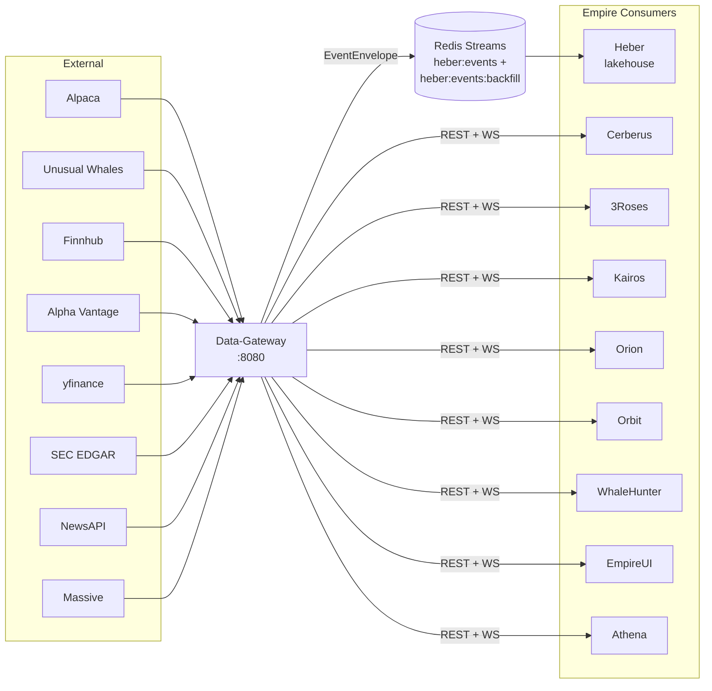
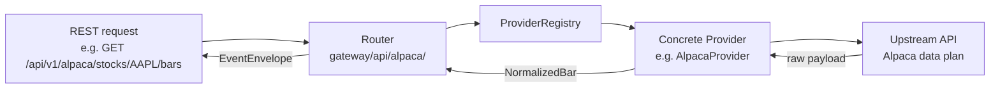
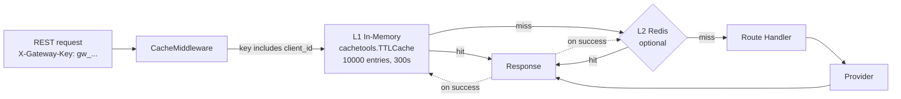
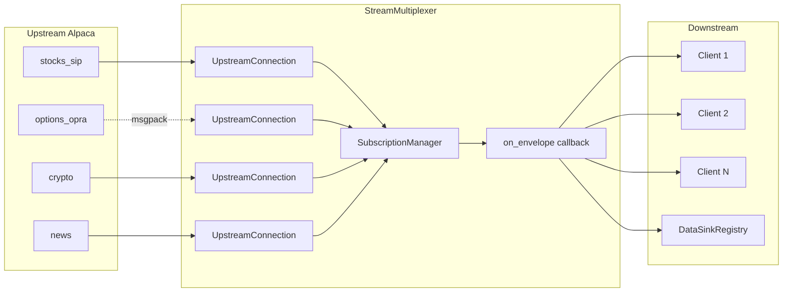
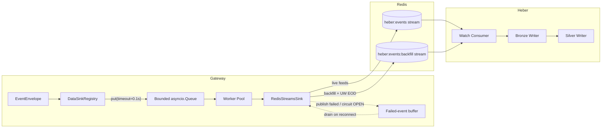
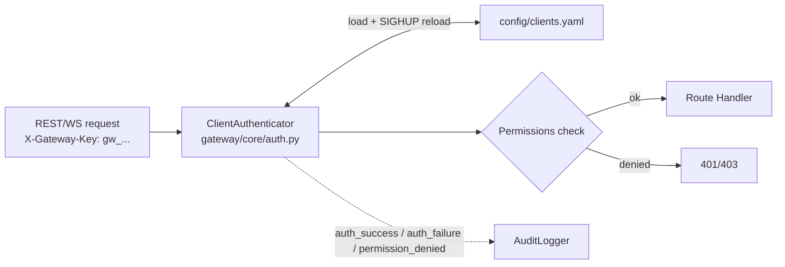

> **AUTO-GENERATED by the `learn` skill — do not hand-edit; regenerate instead.** On conflict with the hand-written root docs (README.md, CLAUDE.md, CONTRIBUTING.md, TESTING.md, DEVELOPER_NOTES.md, DEPENDENCIES.md), the root docs win. See docs/README.md.

# Data-Gateway — System Architecture

Subsystem diagrams and dataflow. For per-module reference see [codebase-summary.md](codebase-summary.md); for ops detail see [RUNBOOK.md](RUNBOOK.md).

---

## 1. Position in the Empire Monorepo

Data-Gateway is the **single ingress point** — downstream services never call providers directly. Massive (ex-Polygon, historical aggregate bars) is loaded from `config/providers.yaml` and directly callable but not yet mapped into the fallback routes.

---

## 2. Provider Routing

Providers are loaded at startup from `config/providers.yaml` (8 providers: alpaca, yfinance, finnhub, alphavantage, massive, unusual_whales, news, sec) and registered with a `ProviderRegistry`. Each route maps a data type to a priority-ordered list of providers with fallback policies. Providers marked `required: true` (alpaca, yfinance, unusual_whales) abort startup on load/init failure when `GATEWAY_DEBUG=false`.

Provider modules implement `DataProvider` (`gateway/core/provider.py`):
- `initialize()`, `shutdown()`, `health_check()` — lifecycle
- `get_bars()`, `get_quotes()`, `get_trades()` — REST (return normalized types)
- `subscribe()`, `unsubscribe()`, `stream()` — streaming

---

## 3. REST Cache Strategy

**Per-client scoping.** Cache keys include the `X-Gateway-Key` client id so authorized responses don't leak across clients with different permissions.

**Configurable via:**
- `GATEWAY_CACHE_MAX_SIZE` (default 10000)
- `GATEWAY_CACHE_DEFAULT_TTL` (default 300s)
- `GATEWAY_CACHE_REDIS_URL` (optional L2)

**Per-endpoint TTLs** are overridden in router code via the `CacheMiddleware`'s exemption table — e.g. real-time quotes use 30s; daily bars use 1h.

---

## 4. EventEnvelope Pipeline (egress)

Every event — REST response, WebSocket message, or poller result — passes through the same pipeline before reaching downstream Redis Streams and clients.

```mermaid
flowchart LR
    RAW[Raw provider data]
    NORM[Provider adapter normalization<br/>gateway/providers/]
    NORMED[NormalizedBar/Quote/Trade<br/>or feed-specific schema]
    WRAP{Path?}
    SLOW[wrap_event<br/>full Pydantic validation]
    FAST[fast_wrap_streaming_event<br/>skip validation]
    ENV[EventEnvelope]
    DEDUP[compute_event_id<br/>BLAKE2b hash]
    REG[DataSinkRegistry]
    Q[Bounded asyncio.Queue<br/>per sink]
    WRK[Worker Pool]
    RS[RedisStreamsSink]
    STREAM[(heber:events /<br/>heber:events:backfill)]
    BUF[Failed-event buffer<br/>capacity 50_000 configurable]
    WS[Downstream WebSocket clients]

    RAW --> NORM --> NORMED --> WRAP
    WRAP -->|REST / poller| SLOW --> ENV
    WRAP -->|streaming| FAST --> ENV
    ENV --> DEDUP --> REG
    REG -- put with timeout --> Q --> WRK --> RS --> STREAM
    RS -. publish failed / circuit OPEN .-> BUF
    BUF -. drain on reconnect .-> RS
    ENV --> WS
```

### Event ID

`event_id = BLAKE2b(provider | feed | instrument_key | ts_event | feed_specific_unique_fields)`

`FEED_UNIQUE_FIELDS` (in `gateway/core/envelope.py`) maps each feed (32 feeds) to the fields needed for stable hashing. The same upstream Alpaca event delivered twice (e.g. reconnect replay) resolves to the same `event_id`, and Heber's dedup layers reject the duplicate. Recent additions: `iv_term_structure` keys on `expiry` per row (the payload has no timestamp, so `ts_event=now()` collided across expiries), `insider_trades` keys on the per-row `id` (root cause of a 200→~2 Bronze collapse), `oi_change` gained `option_symbol`, plus `income_statement`/`balance_sheet`/`cash_flow` and `treasury_yields` entries.

### Instrument keys (canonical across Empire)
| Type | Format | Example |
|------|--------|---------|
| Equity | `equity:{SYMBOL}` | `equity:AAPL` |
| Option | `option:OCC:{OCC_SYMBOL}` | `option:OCC:AAPL250117C00200000` |
| Crypto | `crypto:{BASE}-{QUOTE}` | `crypto:BTC-USD` |
| Forex | `forex:{BASE}-{QUOTE}` | `forex:EUR-USD` |

### Gotcha: `_infer_instrument_type` and per-underlying analytics
Any payload with `strike` or `expiry` is flagged `instrument_type=option`. For per-underlying analytics that include an expiry (e.g. `iv_term_structure`), this is wrong and Heber drops 100% of records. Pollers for such feeds must pass `instrument_type_override="equity"` and `instrument_key_override=f"equity:{ticker}"` to `wrap_event()`. Reference: `_poll_eod_iv_term_structure` in `gateway/core/uw_poller.py`.

---

## 5. WebSocket Multiplexer

Alpaca data plans limit one concurrent stream connection per account. The multiplexer maintains one upstream per stream type and fans out to N downstream clients.

**Key behaviours:**
- **Lazy connection** — upstream WS opens on the first client subscription
- **Subscription aggregation** — computes the union across clients
- **Reference counting** — upstream unsubscribes only when the last client drops
- **Auto-reconnect** with exponential backoff + jitter
- **Supervisor** — revives dormant upstream connections that still have live subscribers
- **MessagePack** for OPRA (binary), JSON for the rest
- **Sink + fanout** both fire from the **same** `on_envelope` callback so the sink can never be silently bypassed (a historical regression)

Heartbeat: 30s interval, 10s timeout, max 3 missed before disconnect.

---

## 6. Data Sink (Heber Integration)

### Backfill stream isolation

Bulk historical publishes (the backfill engine and the UW EOD per-ticker feeds) route to a dedicated stream, `heber:events:backfill` (env `GATEWAY_BACKFILL_STREAM`), with its own MAXLEN cap `GATEWAY_BACKFILL_STREAM_MAX_LEN` (default 1,000,000) — separate from the live stream's `GATEWAY_DATA_SINK_MAX_STREAM_LEN` (default 100,000; production compose sets 500,000). `_max_len_for(topic)` in `gateway/core/redis_sink.py` applies the per-stream cap. Rationale: on 2026-07-19 a 976K-record backfill overran the shared cap and self-evicted un-read live UW feeds.

### Bounded queue + worker pool (single in-process gate)

`DataSinkRegistry.publish_all()` checks dedup + circuit, then `put`s the event on the sink's queue, blocking at most `data_sink_producer_block_timeout_seconds` (default 0.1s).

| Setting | Default | Purpose |
|---------|---------|---------|
| `GATEWAY_DATA_SINK_QUEUE_SIZE` | `16384` | Bounded per-sink dispatch queue size |
| `GATEWAY_DATA_SINK_WORKER_COUNT` | `24` | Worker tasks draining each queue (compose sets 32) |
| `GATEWAY_DATA_SINK_REDIS_POOL_SIZE` | `32` | Max connections in the Redis sink pool (compose sets 64) |
| `GATEWAY_DATA_SINK_PRODUCER_BLOCK_TIMEOUT_SECONDS` | `0.1` | Max producer block on a full queue |
| `GATEWAY_DATA_SINK_FAILED_BUFFER_CAPACITY` | `50000` | Failed-event retry buffer capacity |

A producer timeout fires only when *both* the queue is full *and* workers cannot drain it within the producer-block timeout. The event is then **spilled to the sink's failover buffer** (`sink.buffer_event()` + `sink.schedule_drain()`) rather than dropped — spilled events are recoverable and logged at WARNING with `spilled_to_buffer=True`. Only if the buffer itself refuses the event is it truly lost: that logs CRITICAL and increments the `producer_timeout_loss` stat alongside `gateway_sink_producer_timeout_drops_total{sink}`; the `SinkProducerTimeoutDrops` Prometheus alert fires on any non-zero rate.

> **Historical note.** The pre-2026 design used an `asyncio.Semaphore` that silently dropped every event scheduled once the in-flight cap was reached. Operators observed tens of thousands of lost events per minute around opening bell with no recovery path. The bounded queue + worker pool replaced it. The obsolete `GATEWAY_DATA_SINK_STREAM_PUBLISH_MAX_INFLIGHT` / `_MAX_PENDING` env vars were removed.

### Redis-sink resilience
`RedisStreamsSink` holds a Redis connection pool + bounded failed-event buffer (capacity `GATEWAY_DATA_SINK_FAILED_BUFFER_CAPACITY`, default 50,000):
- **Publish** retries transient failures; exhausted retries (or events arriving while the circuit is OPEN) route to the buffer.
- **Drain on reconnect** — buffer drains automatically; events failing the drain are re-buffered.
- **Eviction metrics** — full-deque evictions surface as `gateway_sink_buffer_evictions_total{sink}` + `gateway_sink_buffer_size{sink}`; `SinkBufferEvictionsActive` alert fires on any non-zero rate.
- **Dedup** — `DataSinkRegistry` checks the Redis dedup cache (`set_nx`, 24h TTL) before enqueue.
- **Circuit breaker** — the `data_sink:redis_streams` circuit gates publishing; OPEN routes events to the buffer rather than dropping them. Trip threshold raised to 20 (vs default 5) because each counted failure already survived the sink's own 3-attempt retry — 20 means Redis is genuinely down.

### Redis durability (deployment)
The compose Redis (`redis:7-alpine`) runs with AOF persistence (`--appendonly yes --appendfsync everysec`, since 2026-07-19 after a power outage restarted it empty) and `--maxmemory 4gb --maxmemory-policy volatile-lru` (since 2026-07-20): TTL'd cache/dedup keys are evictable, while the persistent heber streams and consumer groups carry no TTL and are non-evictable — at-cap writes error into the sink failover buffer instead of silently evicting stream data. The instance is unauthenticated and bound to `127.0.0.1` only.

### Graceful shutdown
`DataSinkRegistry.close_all()` first drains per-sink queues (`queue.join()`) so queued events get a final publish attempt, then `RedisStreamsSink.close()` makes one last buffer-drain attempt against the live connection (logs `redis_sink_close_buffer_nonempty` with a count if anything remains).

---

## 7. Authentication & Permissions

**Client model (`config/clients.yaml`, 9 clients):**
- `id`, `key_hash` (sha256; only the `test` dev client keeps a plaintext key), `role` (`trader` | `admin` | `super_admin`)
- `old_key_hashes` — optional list supporting zero-downtime key rotation
- `permissions.providers` — allowed provider list
- `permissions.feeds` — allowed feed list
- `permissions.max_symbols` — WS subscription cap
- `permissions.rate_limit` — per-minute REST cap (overrides default; enforced per client)
- `permissions.trading` — required for mutating trading endpoints
- `enabled` — global enable flag

**Role guards:**
- Admin endpoints: `admin` or `super_admin`
- Alpaca trading/account endpoints: `trader`, `admin`, or `super_admin`
- Account-wide flatten (`DELETE /orders`, `DELETE /positions`): `super_admin` only
- All other endpoints: any role with matching provider/feed permission

SIGHUP atomically reloads `clients.yaml` without restart. At startup, client ids whose order-ownership prefixes would collide (one id a prefix of another) are rejected.

### Trading Order Isolation

Every order placed through the trading router carries an ownership-prefixed `client_order_id`: auto-generated ids are `c-{client_id}-dg-{uuid}` and caller-supplied ids get the same `c-{client_id}-` prefix applied (foreign prefixes rejected, Alpaca's 128-char ceiling enforced). This lets multiple trading systems (Cerberus, 3Roses, Kairos, Orion, Drogon) share a single Alpaca account without order collisions. The gateway enforces ownership on list, get, replace, and cancel — callers cannot touch orders they didn't create. The full prefixed id is returned in `meta.client_order_id` on success **and** in the 504 timeout detail, so a timed-out submit is safely retryable (Alpaca dedupes by `client_order_id`). Writes use a 25s wall-clock timeout vs 15s for reads.

Mutating endpoints (`POST /orders`, `PATCH /orders/{id}`, `DELETE /orders`) require both `role: trader` AND `permissions.trading: true` in `clients.yaml`. Live (non-paper) trading additionally requires `GATEWAY_ALLOW_LIVE_TRADING=true` **and** a recognized live `APCA_API_BASE_URL` — paper mode is the fail-safe default.

---

## 8. Background Pollers

| Poller | Module | Cadence | Feeds |
|--------|--------|---------|-------|
| **UW real-time** | `core/uw_poller.py` | Loop ticks 15s; per-feed cadence | `flow_alerts` (5m), `darkpool` (15s rush / 30s market / 60s ext), `market_tide` (1h), `sector_tide` (1h) |
| **UW EOD** | `core/uw_poller.py` | Daily at `GATEWAY_UW_EOD_HOUR:MINUTE` ET (default 16:30) | Per-ticker: `greek_exposure`, `iv_rank`, `iv_term_structure`, `oi_change`, `historic_option_volume`, `short_interest`, `short_volume`, `ftds` + market-wide `congress_trades`, `insider_trades` |
| **Treasury** | `core/treasury_poller.py` | Configurable | Alpha Vantage treasury yields |
| **Quotes** | `core/quotes_poller.py` | `GATEWAY_QUOTES_POLLER_INTERVAL_SECONDS` (default 30s) | REST quotes for mega-caps + ETFs when no active WS subscription |
| **Trades** | `core/trades_poller.py` | `GATEWAY_TRADES_POLLER_INTERVAL_SECONDS` (default 30s) | `stock_trades` for configured symbols |
| **Crypto** | `core/crypto_poller.py` | Configurable | Crypto bars |
| **News** | `core/news_poller.py` | `GATEWAY_NEWS_POLLER_INTERVAL_SECONDS` (default 120s) | `news` — market-wide or symbol-specific articles |
| **Option capture** | `core/option_capture.py` | Periodic snapshots + optional WS | Alpaca option chains |

All pollers publish through `DataSinkRegistry` — the same egress path as REST and streaming. The UW EOD per-ticker feeds and the backfill engine publish with `topic=heber:events:backfill` (see §6 stream isolation); the live 5-min feeds (flow_alerts, darkpool, market/sector tide) stay on `heber:events`. EOD gating checks and envelope building run off-loop via `asyncio.to_thread`, and the fan-out is spawned as a background task (`uw_poller_eod`) with a date-guard rollback so a failed run retries the same day.

### UW Flow Fanout + Replay (`core/flow_fanout.py`, `core/flow_replay.py`)

When `GATEWAY_WS_FLOW_FANOUT_ENABLED=true` (default), successfully-published UW flow envelopes are fanned out to subscribed downstream WebSocket clients in real time via `FlowFanout`. This is separate from the Alpaca multiplexer — it uses an `on_flow_envelope` callback from the UW poller, delivering the already-published envelope with a Decimal-safe wire copy so the payload stays byte-identical to the Redis copy (same `event_id` → push/poll duplicates collapse in downstream dedupers). Clients subscribe per-symbol or firehose (empty symbol list, recorded as `flow_alerts:*`); delivery is bounded (2s timeout) so a slow client can't stall the poller.

**Resumable delivery:** `RedisFlowReplayStore` appends each delivered envelope to a durable, MAXLEN-capped Redis stream (`GATEWAY_WS_FLOW_REPLAY_STREAM`, default `gateway:flow_alerts:replay`, cap `GATEWAY_WS_FLOW_REPLAY_MAX_LEN=100000`). A subscribing client may pass `after_stream_id` (a Redis stream cursor) to resume: the ack carries `resume_supported` + `replay_high_watermark`, then — only after the subscription ack — the wire sequence is `replay_begin` → replayed events (each with `stream_cursor`) → `replay_complete`, followed by buffered live events (deduped by cursor, held behind a replay barrier). Resume caps at `GATEWAY_WS_FLOW_REPLAY_MAX_EVENTS_PER_RESUME` (default 50,000); a cursor older than retained history raises `replay_error`. Degradations: `GW-W5003` (flow producer not wired), `GW-W5004` (durable replay store unavailable).

### Ticker Universe (`core/ticker_universe.py`)
- **PIT universe (preferred):** when `GATEWAY_UW_UNIVERSE_FILE` exists (default `config/uw_pit_universe.json`, exported from Atlas's survivorship-free PIT parquet, ~989 active symbols), UW EOD capture uses its `active` list and **disables** dynamic screener rotation
- **Fallback — Core (~30):** mega-cap stocks + major ETFs + sector ETFs (SPY, QQQ, AAPL, NVDA, XLF, …)
- **Fallback — Dynamic (default 20):** refreshed daily from UW stock screener, sorted by options activity, deduped against the core set

---

## 9. Graceful Shutdown (8 steps)

`ShutdownCoordinator` (`gateway/core/shutdown.py`):

1. Mark service as shutting down (`/health/ready` → 503)
2. Notify connected WebSocket clients (`shutdown` message)
3. Drain period (`GATEWAY_SHUTDOWN_DRAIN_SECONDS`, default 30s)
4. Stop streaming producers — `OptionCaptureService` + `StreamMultiplexer` (15s timeout)
5. Stop polling producers — pollers, `FlowFanout.close()` (drains delivery/replay tasks, closes the replay store), backfill engine, provider registry
6. Close client WS connections (1001 Going Away)
7. Drain per-sink queues + close sink connections (`sink_registry.close_all()`); stop the loop watchdog
8. Reset coordinator state; finally flush the logging queue (`empire_core.logger.shutdown_logging()`)

Producers stop **before** the sink is drained/closed — otherwise tail events from in-flight poller iterations would be silently dropped once the registry is disabled.

---

## 10. Observability

- **Metrics:** Prometheus at `/metrics`. Key gauges: `gateway_sink_queue_size`, `gateway_sink_queue_capacity`, `gateway_sink_worker_count`, `gateway_sink_buffer_size{sink}`, plus event-loop-stall and circuit-breaker-state metrics. Key counters: `gateway_sink_producer_timeout_drops_total{sink}`, `gateway_sink_buffer_evictions_total{sink}`, and per-feed published/duplicate/drop meters. Alerts in `config/prometheus_alerts.yml`.
- **Event-loop watchdog:** `LoopStallWatchdog` (`core/loop_watchdog.py`, on by default via `GATEWAY_LOOP_WATCHDOG_ENABLED`) — an async heartbeat task stamps monotonic time while an off-loop daemon thread detects staleness beyond `GATEWAY_LOOP_WATCHDOG_STALL_THRESHOLD_SECONDS` (default 5.0s). On a stall it dumps all thread stacks (faulthandler) + gc stats into a structured `event_loop_stall_detected` log, re-samples through the stall (up to 5 samples), and logs total stalled seconds in `event_loop_stall_recovered`.
- **Logs:** structured JSON via `empire_core.logger` → `logs/data-gateway_{YYYY-MM-DD}.log` (all levels) + `logs/data-gateway_errors_{YYYY-MM-DD}.log` (WARNING+). Daily rotation; 14-day retention by default (production compose sets `EMPIRE_LOG_BACKUP_COUNT=30`).
- **Audit:** dedicated `AuditLogger` writes structured events for auth/admin/security actions. See [AUDIT_LOGGING.md](AUDIT_LOGGING.md).
- **Health:** `GET /health` (liveness), `GET /health/ready` (readiness with per-component checks), `GET /health/status` (detailed).
- **Catalog:** `GET /catalog/`, `/catalog/streams`, `/catalog/providers`, `/catalog/feeds` — runtime API discovery for downstream services.

---

## 11. Related Documents

- [project-overview-pdr.md](project-overview-pdr.md) — purpose, scope, design rationale
- [codebase-summary.md](codebase-summary.md) — module-by-module map
- [api-reference.md](api-reference.md) — endpoint catalog
- [configuration-guide.md](configuration-guide.md) — env vars + YAML config
- [deployment-guide.md](deployment-guide.md) — Docker + CI
- [code-standards.md](code-standards.md) — conventions
- [RUNBOOK.md](RUNBOOK.md) — operations, troubleshooting
- [AUDIT_LOGGING.md](AUDIT_LOGGING.md) — audit taxonomy
- [CONSUMER_GUIDE.md](CONSUMER_GUIDE.md) — downstream consumer integration
