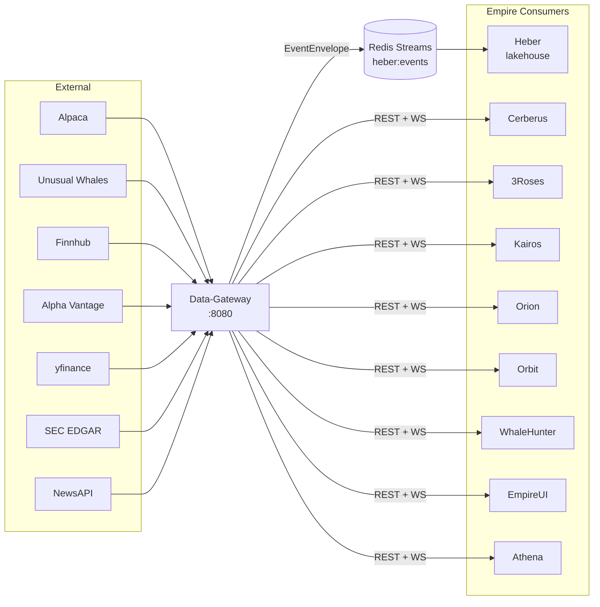
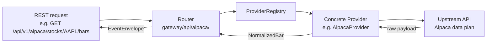
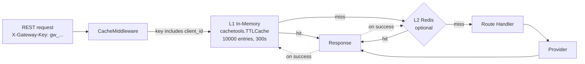
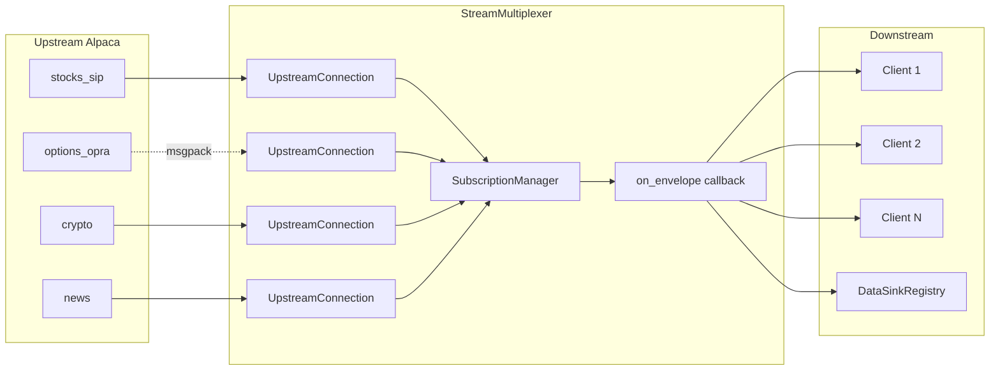
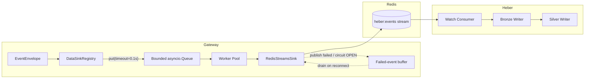
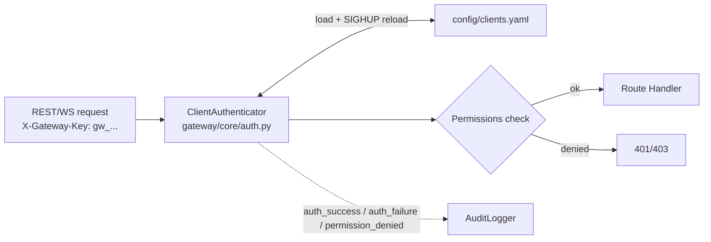

# Data-Gateway — System Architecture

Subsystem diagrams and dataflow. For per-module reference see [codebase-summary.md](codebase-summary.md); for ops detail see [RUNBOOK.md](RUNBOOK.md); for the original long-form architecture deep-dive see [ARCHITECTURE.md](ARCHITECTURE.md).

---

## 1. Position in the Empire Monorepo

Data-Gateway is the **single ingress point** — downstream services never call providers directly.

---

## 2. Provider Routing

Providers are loaded at startup from `config/providers.yaml` and registered with a `ProviderRegistry`. Each route maps a data type to a priority-ordered list of providers with fallback policies.

Provider modules implement `DataProvider` (`gateway/core/provider.py`):
- `initialize()`, `shutdown()`, `health_check()` — lifecycle
- `get_bars()`, `get_quotes()`, `get_trades()` — REST (return normalized types)
- `subscribe()`, `unsubscribe()`, `stream()` — streaming

---

## 3. REST Cache Strategy

**Per-client scoping.** Cache keys include the `X-Gateway-Key` client id so authorized responses don't leak across clients with different permissions.

**Configurable via:**
- `GATEWAY_CACHE_MAX_SIZE` (default 10000)
- `GATEWAY_CACHE_DEFAULT_TTL` (default 300s)
- `GATEWAY_CACHE_REDIS_URL` (optional L2)

**Per-endpoint TTLs** are overridden in router code via the `CacheMiddleware`'s exemption table — e.g. real-time quotes use 30s; daily bars use 1h.

---

## 4. EventEnvelope Pipeline (egress)

Every event — REST response, WebSocket message, or poller result — passes through the same pipeline before reaching downstream Redis Streams and clients.

```mermaid
flowchart LR
    RAW[Raw provider data]
    NORM[DataNormalizer<br/>gateway/core/normalizer.py]
    NORMED[NormalizedBar/Quote/Trade<br/>or feed-specific schema]
    WRAP{Path?}
    SLOW[wrap_event<br/>full Pydantic validation]
    FAST[fast_wrap_streaming_event<br/>skip validation]
    ENV[EventEnvelope]
    DEDUP[compute_event_id<br/>BLAKE2b hash]
    REG[DataSinkRegistry]
    Q[Bounded asyncio.Queue<br/>per sink]
    WRK[Worker Pool]
    RS[RedisStreamsSink]
    STREAM[(heber:events)]
    BUF[Failed-event buffer<br/>deque maxlen=10_000]
    WS[Downstream WebSocket clients]

    RAW --> NORM --> NORMED --> WRAP
    WRAP -->|REST / poller| SLOW --> ENV
    WRAP -->|streaming| FAST --> ENV
    ENV --> DEDUP --> REG
    REG -- put with timeout --> Q --> WRK --> RS --> STREAM
    RS -. publish failed / circuit OPEN .-> BUF
    BUF -. drain on reconnect .-> RS
    ENV --> WS
```

### Event ID

`event_id = BLAKE2b(provider | feed | instrument_key | ts_event | feed_specific_unique_fields)`

`FEED_UNIQUE_FIELDS` (in `gateway/core/envelope.py`) maps each feed to the fields needed for stable hashing. The same upstream Alpaca event delivered twice (e.g. reconnect replay) resolves to the same `event_id`, and Heber's dedup layers reject the duplicate.

### Instrument keys (canonical across Empire)
| Type | Format | Example |
|------|--------|---------|
| Equity | `equity:{SYMBOL}` | `equity:AAPL` |
| Option | `option:OCC:{OCC_SYMBOL}` | `option:OCC:AAPL250117C00200000` |
| Crypto | `crypto:{BASE}-{QUOTE}` | `crypto:BTC-USD` |
| Forex | `forex:{BASE}-{QUOTE}` | `forex:EUR-USD` |

### Gotcha: `_infer_instrument_type` and per-underlying analytics
Any payload with `strike` or `expiry` is flagged `instrument_type=option`. For per-underlying analytics that include an expiry (e.g. `iv_term_structure`), this is wrong and Heber drops 100% of records. Pollers for such feeds must pass `instrument_type_override="equity"` and `instrument_key_override=f"equity:{ticker}"` to `wrap_event()`. Reference: `_poll_eod_iv_term_structure` in `gateway/core/uw_poller.py`.

---

## 5. WebSocket Multiplexer

Alpaca data plans limit one concurrent stream connection per account. The multiplexer maintains one upstream per stream type and fans out to N downstream clients.

**Key behaviours:**
- **Lazy connection** — upstream WS opens on the first client subscription
- **Subscription aggregation** — computes the union across clients
- **Reference counting** — upstream unsubscribes only when the last client drops
- **Auto-reconnect** with exponential backoff + jitter
- **MessagePack** for OPRA (binary), JSON for the rest
- **Sink + fanout** both fire from the **same** `on_envelope` callback so the sink can never be silently bypassed (a historical regression)

Heartbeat: 30s interval, 10s timeout, max 3 missed before disconnect.

---

## 6. Data Sink (Heber Integration)

### Bounded queue + worker pool (single in-process gate)

`DataSinkRegistry.publish_all()` checks dedup + circuit, then `put`s the event on the sink's queue, blocking at most `data_sink_producer_block_timeout_seconds` (default 0.1s).

| Setting | Default | Purpose |
|---------|---------|---------|
| `GATEWAY_DATA_SINK_QUEUE_SIZE` | `16384` | Bounded per-sink dispatch queue size |
| `GATEWAY_DATA_SINK_WORKER_COUNT` | `16` | Worker tasks draining each queue |
| `GATEWAY_DATA_SINK_REDIS_POOL_SIZE` | `32` | Max connections in the Redis sink pool |
| `GATEWAY_DATA_SINK_PRODUCER_BLOCK_TIMEOUT_SECONDS` | `0.1` | Max producer block on a full queue before drop |

A drop fires only when *both* the queue is full *and* workers cannot drain it within the producer-block timeout. Drops surface as `gateway_sink_producer_timeout_drops_total{sink}` and a CRITICAL log line; the `SinkProducerTimeoutDrops` Prometheus alert fires on any non-zero rate.

> **Historical note.** The pre-2026 design used an `asyncio.Semaphore` that silently dropped every event scheduled once the in-flight cap was reached. Operators observed tens of thousands of lost events per minute around opening bell with no recovery path. The bounded queue + worker pool replaced it. The obsolete `GATEWAY_DATA_SINK_STREAM_PUBLISH_MAX_INFLIGHT` / `_MAX_PENDING` env vars were removed.

### Redis-sink resilience
`RedisStreamsSink` holds a Redis connection pool + bounded failed-event buffer (`deque(maxlen=10_000)`):
- **Publish** retries transient failures; exhausted retries (or events arriving while the circuit is OPEN) route to the buffer.
- **Drain on reconnect** — buffer drains automatically; events failing the drain are re-buffered.
- **Eviction metrics** — full-deque evictions surface as `gateway_sink_buffer_evictions_total{sink}` + `gateway_sink_buffer_size{sink}`; `SinkBufferEvictionsActive` alert fires on any non-zero rate.
- **Dedup** — `DataSinkRegistry` checks the Redis dedup cache (`set_nx`, 24h TTL) before enqueue.
- **Circuit breaker** — the `data_sink:redis_streams` circuit gates publishing; OPEN routes events to the buffer rather than dropping them. Trip threshold raised to 20 (vs default 5) because each counted failure already survived the sink's own 3-attempt retry — 20 means Redis is genuinely down.

### Graceful shutdown
`DataSinkRegistry.close_all()` first drains per-sink queues (`queue.join()`) so queued events get a final publish attempt, then `RedisStreamsSink.close()` makes one last buffer-drain attempt against the live connection (logs `redis_sink_close_buffer_nonempty` with a count if anything remains).

---

## 7. Authentication & Permissions

**Client model (`config/clients.yaml`):**
- `id`, `key`, `role` (`trader` | `admin` | `super_admin`)
- `permissions.providers` — allowed provider list
- `permissions.feeds` — allowed feed list
- `permissions.max_symbols` — WS subscription cap
- `permissions.rate_limit` — per-minute REST cap (overrides default)
- `enabled` — global enable flag

**Role guards:**
- Admin endpoints: `admin` or `super_admin`
- Alpaca trading/account endpoints: `trader`, `admin`, or `super_admin`
- All other endpoints: any role with matching provider/feed permission

SIGHUP reloads `clients.yaml` without restart.

### Trading Order Isolation

Every order placed through the trading router is prefixed with `c-{client_id}-` (e.g. `c-cerberus-ab12cd`), allowing multiple trading systems (Cerberus, 3Roses, Kairos) to share a single Alpaca account without order collisions. The gateway enforces ownership on read, replace, and cancel — callers cannot touch orders they didn't create. This uses `ClientAuthenticator.list_client_ids()` to find the longest matching prefix.

Mutating endpoints (`POST /orders`, `PATCH /orders/{id}`, `DELETE /orders`) require both `role: trader` AND `permissions.trading: true` in `clients.yaml`.

### Key Load Balancer (`core/balancer.py`)

Experimental: `KeyLoadBalancer` supports round-robin across multiple Alpaca API keys for rate-limit headroom. Disabled by default. Not yet wired to routing in production.

---

## 8. Background Pollers

| Poller | Module | Cadence | Feeds |
|--------|--------|---------|-------|
| **UW real-time** | `core/uw_poller.py` | Loop ticks 15s; per-feed cadence | `flow_alerts` (5m), `darkpool` (15s rush / 30s market / 60s ext), `market_tide` (1h), `sector_tide` (1h) |
| **UW EOD** | `core/uw_poller.py` | Daily at `GATEWAY_UW_EOD_HOUR:MINUTE` ET (default 16:30) | Per-ticker: `greek_exposure`, `iv_rank`, `iv_term_structure`, `oi_change`, `historic_option_volume`, `short_interest`, `short_volume`, `ftds` + market-wide `congress_trades`, `insider_trades` |
| **Treasury** | `core/treasury_poller.py` | Configurable | Alpha Vantage treasury yields |
| **Quotes** | `core/quotes_poller.py` | `GATEWAY_QUOTES_POLLER_INTERVAL_SECONDS` (default 30s) | REST quotes for mega-caps + ETFs when no active WS subscription |
| **Trades** | `core/trades_poller.py` | `GATEWAY_TRADES_POLLER_INTERVAL_SECONDS` (default 30s) | `stock_trades` for configured symbols |
| **Crypto** | `core/crypto_poller.py` | Configurable | Crypto bars |
| **News** | `core/news_poller.py` | `GATEWAY_NEWS_POLLER_INTERVAL_SECONDS` (default 120s) | `news` — market-wide or symbol-specific articles |
| **Option capture** | `core/option_capture.py` | Periodic snapshots + optional WS | Alpaca option chains |

All pollers publish through `DataSinkRegistry` — the same egress path as REST and streaming.

> **UW Flow Fanout:** When `GATEWAY_WS_FLOW_FANOUT_ENABLED=true` (default), successfully-published UW flow events are fanned out to subscribed downstream WebSocket clients in real time. This is separate from the Alpaca multiplexer — it uses an `on_flow_envelope` callback from the UW poller into the WS connection manager.

### Ticker Universe (`core/ticker_universe.py`)
- **Core (~30):** mega-cap stocks + major ETFs + sector ETFs (SPY, QQQ, AAPL, NVDA, XLF, …)
- **Dynamic (default 20):** refreshed daily from UW stock screener, sorted by options activity
- Deduped against core set

---

## 9. Graceful Shutdown (8 steps)

`ShutdownCoordinator` (`gateway/core/shutdown.py`):

1. Mark service as shutting down (`/health/ready` → 503)
2. Notify connected WebSocket clients (`shutdown` message)
3. Drain period (`GATEWAY_SHUTDOWN_DRAIN_SECONDS`, default 30s)
4. Stop `OptionCaptureService` + `StreamMultiplexer` (15s timeout)
5. Close client WS connections (1001 Going Away)
6. Flush stream→sink publish tasks (2s timeout)
7. Stop pollers, backfill engine, provider registry
8. Reset coordinator state

---

## 10. Observability

- **Metrics:** Prometheus at `/metrics`. Key gauges: `gateway_sink_queue_size`, `gateway_sink_queue_capacity`, `gateway_sink_worker_count`, `gateway_sink_buffer_size{sink}`. Key counters: `gateway_sink_producer_timeout_drops_total{sink}`, `gateway_sink_buffer_evictions_total{sink}`. Alerts in `config/prometheus_alerts.yml`.
- **Logs:** structured JSON via `empire_core.logger` → `logs/data-gateway_{YYYY-MM-DD}.log` (all levels) + `logs/data-gateway_errors_{YYYY-MM-DD}.log` (WARNING+). Daily rotation, 14-day retention.
- **Audit:** dedicated `AuditLogger` writes structured events for auth/admin/security actions. See [AUDIT_LOGGING.md](AUDIT_LOGGING.md).
- **Health:** `GET /health` (liveness), `GET /health/ready` (readiness with per-component checks), `GET /health/status` (detailed).
- **Catalog:** `GET /catalog/`, `/catalog/streams`, `/catalog/providers`, `/catalog/feeds` — runtime API discovery for downstream services.

---

## 11. Related Documents

- [project-overview-pdr.md](project-overview-pdr.md) — purpose, scope, design rationale
- [codebase-summary.md](codebase-summary.md) — module-by-module map
- [api-reference.md](api-reference.md) — endpoint catalog
- [configuration-guide.md](configuration-guide.md) — env vars + YAML config
- [deployment-guide.md](deployment-guide.md) — Docker + CI
- [code-standards.md](code-standards.md) — conventions
- [ARCHITECTURE.md](ARCHITECTURE.md) — older long-form architecture (kept for continuity)
- [RUNBOOK.md](RUNBOOK.md) — operations, troubleshooting
- [AUDIT_LOGGING.md](AUDIT_LOGGING.md) — audit taxonomy
- [CONSUMER_GUIDE.md](CONSUMER_GUIDE.md) — downstream consumer integration
